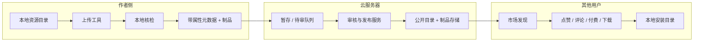

# 04 — Ecosystem（生态：市场、织梦坊、炼化）

## 目标与范围

**目标**：在 goclaw 内提供 **可发现、可安装、可计费、可扩展** 的 Skill / Agent / MCP / Plugin 分发能力，并通过 **织梦坊**（脚手架生成）与 **炼化**（GitHub → 插件包）降低作者成本。

**市场专项**：采用 **云平台承载目录与元数据（Marketplace / Registry）** + **网关节点下载到本地约定目录** 的成熟分层模型；与语言生态中「中央索引 + 本地缓存/安装树」一致（概念上接近 npm Registry、PyPI、VS Code Marketplace 的 **元数据与制品可分离** 思路，落地以 HTTP + Git 为主，不强制 OCI）。

**范围**：

| 在内 | 不在本轮 |
|------|----------|
| **自有上传 / 下载工具**（CLI 或独立命令）：本地上传前 **格式核检**、带属性元数据 **推送到云**；客户端 **从市场拉取制品到本地目录** | 审核员工作台 UI 可放在 **独立运营系统**；goclaw 侧 **预留状态与回调** |
| 目录与安装器（内存/本地 catalog + git clone 或 **云制品 URL** 到本地） | 完整支付收单与税务合规（需对接第三方支付；本仓库仅 **计费模型与校验接口**） |
| **云平台**：资源 **托管在云服务器/对象存储**；对外 **目录 API**、索引同步、鉴权 | 自建全球 CDN（可用对象存储 + 直链替代） |
| 脚手架与发布写入 catalog（可与云同步） | 完整 CI/CD 托管构建 |
| 仓库分析与 manifest 生成（占位 adapter） | 强沙箱隔离（需另接 os/exec + 策略） |
| Gateway 可扩展的 HTTP 设计预留 | 未实现的 handler 见下文「缺口」 |

**依赖**：多租户与鉴权沿用现有 gateway；云平台侧需 **租户上下文** 与可选 **发布者凭证**；计费需对接支付/订阅时再接 `marketplace.Pricing` 字段。

---

## 1. 市场 — `internal/marketplace/`

### 1.0 架构原则（结合成熟生态）

| 原则 | 说明 | goclaw 对应 |
|------|------|-------------|
| **Registry 与运行时解耦** | 目录服务只负责 **元数据**（谁、什么版本、从哪拉、价格标签）；运行时节点的 **Install** 负责落盘与注册。 | `Catalog` + `Installer` 已分离；云侧提供 `Catalog` 的权威来源或增量。 |
| **单一本地安装根** | 所有包落在可配置 `dataDir` 下，路径可预测、可备份、可多实例隔离。 | `{dataDir}/packages/{type}/{name}`（见下）。 |
| **下载到本地目录** | 制品来源以 **Git 仓库 URL** 为主（与 `Package.Repository` 一致）；可选扩展 **HTTP tarball/zip** 或对象存储预签名 URL，但 **解压目标仍为本地目录树**。 | 当前 `git clone --depth=1`；需补 **ref/tag/commit pin**（见 FR）。 |
| **可验证与可信** | 官方包、签名或校验和应在 **拉取前或拉取后** 可验证；`Verified` 为运营标记。 | 字段已有；验证管线待实现。 |
| **离线友好** | 索引可缓存；已下载目录可作为 **离线使用** 前提（与「云仅用于发现」一致）。 | 需 **本地 catalog 快照** + 可选仅使用已缓存包。 |

### 1.1 发布与消费全链路（自有上/下载工具、云托管、审核发布、市场互动）

本节描述 **一套闭环**：作者用 **goclaw 侧上传工具** 在本地核检并标明资源属性后 **上云**；**审核与发布** 可由 **本仓库外的运营/风控系统** 完成；发布后，**同一生态内的其他用户** 在 **市场** 中 **发现、点赞、评论、付费、下载**。

#### 1.1.1 阶段划分

#### 1.1.2 上传工具（goclaw 自有）

| ID | 需求 | 说明 |
|----|------|------|
| **FR-U1** | **独立命令形态** | 以 **CLI 子命令** 或 **独立二进制** 提供（如 `goclaw marketplace push`），与网关进程解耦，便于 CI 与作者本机使用。 |
| **FR-U2** | **上传前本地核检** | 在上传前 **必须通过** 格式与策略检查，失败则 **不上传**、输出可定位错误：manifest/schema、`plugin.json` / SKILL 约定、目录布局、文件大小与数量上限、禁止路径等。 |
| **FR-U3** | **资源属性（元数据）** | 上传请求必须携带并与云端契约一致，至少：**名称**、**版本**（语义化版本建议）、**类型**（对齐 `PackageType`）、**功能说明**（长描述 / README 摘要）、**标签**、**作者/租户**、**License**、可选 **定价**（对齐 `Pricing`）、**源码或制品来源**（Git URL、或本次上传的 zip/tar 校验和）。 |
| **FR-U4** | **传输** | 支持 **HTTPS** 分块上传（元数据 + 制品包）；大文件断点续传可选；凭证使用 **API Key / OAuth**（与租户绑定）。 |
| **FR-U5** | **幂等** | 同一 `name + version + tenant` 重复上传：策略为 **拒绝覆盖** 或 **显式 `--force` + 审核重置**，避免静默覆盖已发布版本。 |

#### 1.1.3 云托管（资源落在云服务器）

| ID | 需求 | 说明 |
|----|------|------|
| **FR-H1** | **制品存储** | 审核前 **暂存桶/目录**；通过后 **发布桶** 或 **带版本前缀的不可变路径**；支持预签名 URL 供下载工具拉取。 |
| **FR-H2** | **元数据服务** | 持久化 FR-U3 字段 + `state`（`pending_review` / `approved` / `rejected` / `published`）、`uploaded_at`、校验和；与 **§1.2** 目录 API 对齐或为其上游。 |
| **FR-H3** | **可见性** | 未发布条目 **仅作者与审核角色** 可见；发布后进入 **公开市场索引**（对齐 `Search`）。 |

#### 1.1.4 审核与发布（可由其他系统实现）

| ID | 需求 | 说明 |
|----|------|------|
| **FR-R1** | **职责边界** | **审核、风控、人工发布** 可在 **独立运营后台、工单或微服务** 中实现；goclaw 核心 **不强制** 内置完整审核 UI。 |
| **FR-R2** | **对接契约** | 云侧或独立审核服务暴露 **审核 API** 或 **队列消费**（拉取 `pending_review` → 返回 `approve|reject` + 备注）；通过后 **原子发布**：写入公开 `Package`、解锁下载 URL、触发 Webhook。 |
| **FR-R3** | **审计** | 保留审核人、时间、结论，满足合规追溯；拒绝原因可对作者可见。 |

#### 1.1.5 发布后：市场发现与互动（消费者）

| 能力 | 需求说明 | 与现有代码 |
|------|----------|------------|
| **发现** | 搜索、类型筛选、标签、排序、详情页（说明、版本历史、作者） | `Catalog.Search`、`Package` |
| **点赞** | 轻量「有用」计数，可与 **星级评分** 并存或二选一产品策略 | 可新增 `Likes` 或沿用 `Rating`/`Downloads` 组合 |
| **评论** | 文本评论、时间序、可选敏感词过滤 | `AddReview`、`Review` |
| **付费** | 展示价格与模型（免费/一次性/订阅）；**下单与 entitlement** 由计费服务校验后再允许 **下载/安装** | `Pricing`；支付网关外接 |
| **下载** | **自有下载工具** 或网关 API：`GET` 制品或触发 `Installer` 从 **发布 URL / Git** 拉取到 **本地约定目录**（见 §1.4） | `Installer`、`IncrementDownloads` |

#### 1.1.6 与「织梦坊 / 炼化」的关系

- **织梦坊** 生成物可走 **同一套上传工具**（先本地核检再推送）。
- **炼化** 输出目录经核检后 **推送上云**，进入同一 **待审 → 发布** 管线。

---

### 1.2 云平台（Marketplace / Registry 服务）— 需求细化

云平台承担 **「权威或准权威目录」**，与仅内存的 `Catalog` 形成 **同步关系**（全量或增量）。不要求与某一公有云强绑定；以下为 **逻辑能力**，可部署在任意云（K8s VM Serverless + 托管 DB/对象存储）。

| ID | 需求 | 说明 |
|----|------|------|
| **FR-M1** | **目录 API** | 提供租户可访问的 **搜索/列表/详情**（对齐 `SearchQuery` / `Package` JSON）；支持分页、排序；HTTPS。 |
| **FR-M2** | **索引发布** | 作者或 CI 通过鉴权 API **注册/更新** `Package`（或上传 **signed registry 清单** 由服务合并）；与 `Catalog.Register` 语义一致。 |
| **FR-M3** | **静态索引导出（可选）** | 定时生成 **只读 JSON 索引**（含版本列表、`repository`、校验信息 URL），供边缘网关 **bulk Register** 或灾备；文件可放对象存储 + CDN。 |
| **FR-M4** | **租户与可见性** | 包级或命名空间级 **public / tenant-private**；搜索默认仅返回当前租户可见 + 公共目录。 |
| **FR-M5** | **鉴权** | 读目录：用户或 API Key；写目录：发布者角色 + 可选双因素；与现有 gateway 身份模型对齐。 |
| **FR-M6** | **审计与限流** | 注册、安装触发（若经云代理）记审计日志；按租户 QPS 限制防滥用。 |
| **FR-M7** | **不下发二进制执行云逻辑** | 云平台 **不执行** 用户包代码；仅元数据与可选 **预检**（URL 可达性、LICENSE 文件存在）异步任务。 |

**非功能（云平台）**

| ID | 说明 |
|----|------|
| **NFR-M1** | 可用性：目录 API 目标 SLA 与网关一致；索引导出失败可告警。 |
| **NFR-M2** | 一致性：同一 `package_id` 更新后，客户端在 TTL 内可接受最终一致；关键字段带 `updated_at`。 |
| **NFR-M3** | 密钥：对象存储凭证、Webhook 密钥仅存于配置与密钥管理，不入库明文。 |

### 1.3 本地节点：下载到本地目录 — 需求细化

本地 **goclaw 进程 / gateway** 侧行为与现有 `Installer` 对齐，并扩展为 **云驱动** 的标准路径。

| 项目 | 约定 |
|------|------|
| **安装根** | `filepath.Join(dataDir, "packages", string(PackageType), pkg.Name)`（见 `installer.go`）。 |
| **获取方式** | 当前：`git clone --depth=1 repoURL targetDir`。 |
| **与云的关系** | 客户端从 **云目录 API** 拉取 `Package` 列表并 **写入本地 `Catalog`（内存或嵌入式 DB）**，再调用 **同一套** `Installer.Install` 完成 **下载到本地目录**；不强制安装请求再经云中转 Git（减少带宽与信任面）。 |

| ID | 需求 | 优先级 |
|----|------|--------|
| **FR-L1** | **版本固定** | `Install` 支持按 **tag、branch 或 commit** clone（`Package.Version` 或新增 `Ref` 字段与实现一致）；`Update` 可对比远端默认分支或最新 tag。 |
| **FR-L2** | **幂等与重试** | 目标目录已存在且非空时：**失败显式** 或 **先清理再装**（策略可配置）；网络失败可重试且不半删用户数据（可选 staging 目录再 rename）。 |
| **FR-L3** | **安装清单** | 本地维护 `installed.json`（或等价）记录 `package_id`、`ref`、安装时间、来源 catalog 版本，供 `ListInstalled` 与卸载对齐 **逻辑 ID**（当前扫描目录仅有 name/type/path）。 |
| **FR-L4** | **Plugin 联动** | `TypePlugin` 安装后加载 `plugin.json` 并 `pluginRegistry.Install`（已有）；路径变更时需保证 **manifest 路径** 与运行时工作目录一致。 |
| **FR-L5** | **仅本地包** | 支持 `Register` 仅存在于本地的包（私有 Git / 内网），**不经过云**；与云目录 **合并策略** 明确（云不覆盖本地同名私有包或命名空间隔离）。 |

### 1.4 同步流程（云 → 本地）

建议标准流程（可实现为定时任务或 CLI / gateway 启动时）：

1. **Authenticate** → 调用云 `GET /v1/marketplace/packages`（或增量 `since`）。
2. **Merge** → 将结果写入本地 `Catalog`（`Register` 批量）。
3. **User action** → 用户选择包 → `Installer.Install(ctx, packageID)` → **下载到本地目录**。
4. **Optional** → `IncrementDownloads` 可上报云（需 FR-M6 与隐私策略）。

### 1.5 现状（代码已有）

| 文件 | 职责 |
|------|------|
| `catalog.go` | `Catalog`：`Package`（含 `Ref` 可选，用于安装时固定 tag/branch/commit）、`Pricing`、`SearchQuery`、评分与评论、`Register` / `Search` / `AddReview` |
| `catalog_persistence.go` | `CatalogSnapshot`、`SaveToFile` / `LoadFromFile`：将目录快照落到磁盘（默认可与 CLI 约定路径 `{dataDir}/marketplace/catalog.json` 配合使用） |
| `installer.go` | `Installer`：staging 目录 clone + 可选按 `Ref` fetch/checkout；安装后写 `{dataDir}/packages/installed.json`；`ListInstalled` **优先读清单**，无清单时回退目录扫描；可选 `plugins.Registry` 注册插件 |
| `cmd/marketplace_cmd.go`（根命令 `goclaw marketplace`） | `marketplace import --file <registry.json>`：将静态 registry（`packages` 数组或 `Package` 列表 JSON）合并进本地 catalog 快照文件；`marketplace push --dir ...`：本地核检后打包目录并 multipart 上传到网关 |
| `internal/http/marketplace.go` | `GET/POST /v1/marketplace/packages`（默认列表仅 `published`，管理员可 `?review_state=`）、`GET /v1/marketplace/packages/{id}`、`GET .../{id}/reviews`、`POST /upload`、`PATCH .../review`（审核）、`POST .../review`（用户评论）、`POST .../like`、`POST .../install`、`GET /installed`：当前作为单机/本地“云目录 API”形态 |
| `ui/web/src/pages/marketplace/` | 列表 `/marketplace`（搜索、安装、点赞、展开评论）；详情 `/marketplace/:id`（元数据、点赞、评论列表与评分提交）；数据来自上述 API |

**依赖**：本机需有 `git`；安装路径为 `{dataDir}/packages/{type}/{name}`。

**已做但仍属最小形态**：

- `push` 已具备本地核检 + ZIP 上传 + staging 落盘；
- 目录/审核/互动/安装 API 已可在单节点网关上跑通；
- Web UI 已有只读/安装导向的最小市场页。

**仍未做（与 §1.1–1.2 产品闭环对齐）**：独立「市场云」控制面二进制、对象存储为必选、完整审核工作流 UI、支付税务合规（Stripe 等 **外接**）、运营后台、完整 i18n。

#### 1.5.1 独立 SaaS 与许可证（当前代码边界）

| 主题 | 说明 |
|------|------|
| **独立部署** | 本仓库提供 **可自托管的网关进程** + PostgreSQL（目录/权益/审计）；无单独「市场云」微服务仓库；对象存储为可选（制品上传）。 |
| **多租户** | HTTP 与 `Package` / 权益行使用 **`tenant_id`**（及 `user_id`）与现有 gateway 会话对齐；搜索与安装在校验租户上下文后执行。 |
| **许可证 / 权益** | 表 **`marketplace_entitlements`**；**`marketplace.HasEntitlement` / `GrantEntitlement`**；非免费包在 **`POST .../install`** 等路径上拒绝无权益调用（`MARKETPLACE_ENTITLEMENT_REQUIRED`）。定价一致性：**`ValidatePricingModel`**、**`InstallBlockedByPricing`**（`internal/marketplace/pricing_validate.go`）。 |
| **试用 / 计费外接** | Stripe webhook、试用发放等见 **`internal/http/marketplace_extra.go`**；无内置收单与发票。 |

### 1.6 其余细化需求（与 1.2–1.3 互补）

| 维度 | 需求说明 | 优先级 |
|------|----------|--------|
| **索引来源** | 支持从 **云平台 API** 与 **静态 registry 文件**（JSON/YAML URL + 校验和）批量 `Register`；定时拉取合并 | P0–P1 |
| **版本语义** | `Package.Version` 与 git tag / commit 对齐；`Install`/`Update` **pin ref**（见 FR-L1） | P1 |
| **签名与可信** | 可选：包清单签名、`Verified` 运营标记、clone 后校验 `expected_commit` | P2 |
| **试用 / 计费** | `Pricing` 已有模型；**计费服务**：校验订阅/用量后再允许 `Install` 或加载插件（与租户、License 绑定） | P2 |
| **演示与试用** | **在线试用**：独立 playground；**离线试用**：`TrialDays` + gateway 记录 | P2 |
| **API** | Gateway：`GET /search`、`POST /install`（或 JSON-RPC）与鉴权一致；**云目录** 可与网关合并部署或独立子域 | P1 |
| **前端** | `ui/web` 市场列表/详情/安装按钮（数据来自云或自建缓存）、i18n | P1 |

### 1.7 验收要点（节选）

- **上传侧**：上传工具在 **未通过本地核检** 时不发起网络请求；通过后可携带 **§1.1.2 FR-U3** 所列属性成功写入 **待审** 或 **直传存储**（依策略）。
- **审核侧**：独立审核系统可对 **待审** 资源 **通过/拒绝**；通过后消费者在 **市场** 中可 **检索到** 该包；拒绝时作者可见原因（若实现 FR-R3）。
- **消费侧**：已发布资源支持 **评论**（`AddReview`）；**付费** 下载前完成 entitlement 校验；**下载** 落到 `{dataDir}/packages/...` 或与 `InstallResult.Path` 一致。
- 配置云 **base URL** 与凭证后，网关或 agent 能 **同步目录** 至本地 `Catalog`，再 **安装到本地目录**，路径符合 `{dataDir}/packages/...`。
- 管理员或脚本仍可通过 **静态文件** `Register`，与云索引 **可合并** 且不破坏本地私有包策略（若实现 FR-L5）。
- 租户内用户执行安装后，磁盘路径与 `plugins.Registry` 状态一致（若启用联动）。
- 计费接入后，未订阅的付费包在安装或启用时被拒绝，并返回可本地化错误码。

---

## 2. 织梦坊 — `internal/workshop/`

### 2.1 现状（代码已有）

| 文件 | 职责 |
|------|------|
| `skill_builder.go` | `SkillBuilder`：由 `SkillTemplate` 生成 SKILL.md 风格正文与目标路径 |
| `agent_builder.go` | `AgentBuilder`：由 `AgentTemplate` 生成 JSON 配置 |
| `publisher.go` | `Publisher`：`Validate`（基础字段）+ `Publish` 写入 `marketplace.Catalog` |

### 2.2 细化需求

| 维度 | 需求说明 | 优先级 |
|------|----------|--------|
| **向导输入** | 收集名称、描述、标签、目标租户；可选从模板库选择 | P1 |
| **校验** | 除当前长度/非空外，增加 **schema 校验**（如 agent JSON、skill  frontmatter） | P1 |
| **与炼化衔接** | 一键「在织梦坊打开」：将 `alchemy.RepoAnalysis` 结果预填到 `SkillBuilder` / `AgentBuilder` | P2 |
| **发布闭环** | `Publish` 成功后触发 **可选** webhook；与 **Installer** 联调：同租户可立即 `Install` 刚发布包；若存在 **云目录**，`Publish` 应对接 **FR-M2**（注册到云平台） | P1 |
| **权限** | 仅允许有 `marketplace.publish`（或等价）角色的用户/服务账号发布 | P1 |

### 2.3 验收要点（节选）

- 从模板生成产物落盘路径符合 `{dataDir}` 与网关沙箱约定。
- 发布后的包在 `Catalog.Search` 中可按作者/租户隔离可见（若产品需要「私有包」）。

---

## 3. 炼化 — `internal/alchemy/`

### 3.1 现状（代码已有）

| 文件 | 职责 |
|------|------|
| `analyzer.go` | `Analyzer`：clone 仓库、目录结构、语言检测、依赖粗检、`RepoAnalysis` |
| `generator.go` | `Generator`：由分析结果生成 `plugins.Manifest` 与语言相关 wrapper（Go/Python/Node/Shell 占位，含 MCP stdio TODO） |

**说明**：炼化流水线中的「沙箱测试」「自动发布」需在 CI/任务系统中另接；当前以库能力为主。

### 3.2 细化需求

| 维度 | 需求说明 | 优先级 |
|------|----------|--------|
| **输入** | 支持 **Git URL + ref**、**本地路径**（开发调试用）；超时与磁盘配额 | P1 |
| **分析深度** | 识别入口、`package.json`/`go.mod`、已有 MCP 描述；输出 **建议的 tool 列表**（启发式） | P1 |
| **生成物** | `plugin.json` 字段完整；各语言 **adapter 非占位**：至少一种（建议 Go）可编译加载 | P1 |
| **测试** | `Publisher.TestResult` 扩展为可注入 **运行测试**：如 `go test`、脚本 smoke；失败则禁止 Publish | P2 |
| **HTTP** | `POST /v1/alchemy/analyze`、`POST /v1/alchemy/generate`（异步 job + poll） | P1 |
| **与织梦坊** | 生成结果一键 **导入 workshop** 编辑再发布 | P2 |

### 3.3 验收要点（节选）

- 对公开示例仓库跑一次 analyze → generate，得到可 `LoadFromDir` 的目录结构（在测试环境验证）。
- 占位 TODO 在文档与代码中显式标出，便于排期。

---

## 4. Web UI

### 4.1 细化需求

| 页面/能力 | 说明 | 优先级 |
|-----------|------|--------|
| 市场首页 | 列表、搜索、类型筛选、跳转详情；数据来自 **云平台目录 API** 或网关代理的同一数据源 | P1 |
| 包详情 | README 渲染、版本/ref 选择、**点赞**、评论、价格与购买/试用、**安装到本机 data 目录**、卸载、评分 | P1 |
| 织梦坊 | 分步向导（Skill / Agent）、预览、发布 | P2 |
| 炼化 | 填 Git URL、展示分析结果、下载生成 zip 或一键发市场 | P2 |
| 通用 | 与现有布局、主题、权限路由一致；[ui/web](../) 规范 | P1 |

**现状**：**`ui/web`** 已有 **`/marketplace`**、**`/dreamweaver`**（能力面板）、**`/dreamweaver/workshop`**（织梦坊分步向导）等；上表仍列 **炼化独立页 / 更强表单** 等增量路线图项。

---

## 5. everything-cli 模块化（先不做）

**边界**：在明确上游 **everything-cli** 的协议范围（仅 CLI 包装、索引服务、还是常驻 agent）前，不新建 `internal/everything/`。

### 5.1 细化需求（立项时补全）

| 阶段 | 内容 |
|------|------|
| 调研 | 功能列表、许可证、与 goclaw 工具系统的映射 |
| 设计 | 进程内模块 vs 子进程 vs MCP 包装；配置键 |
| 集成 | `cmd` 子命令或 gateway 注册只读工具集 |

**状态**：🔴 未启动。

---

## Ideas：需求 3 / 4 / 5（市场、织梦坊、everything-cli）

> 原载于 [DreamWeaver README](./README.md)「Ideas 需求索引」，与本章「Ecosystem」对应。下表为 **ideas 原始进度**；**上文 1–5 节**为细化后的需求分解。

### 3. 市场工具管理（Skills / Agent / MCP / Plugin）

> skills, agent, mcp, plugin 市场工具管理，在 GitHub 上托管相关代码，提供演示说明、试用、收费。

**状态：🟡 部分实现**

| 子项 | 状态 | 说明 |
|------|------|------|
| `internal/marketplace/catalog.go` | 🟢 已实现 | Catalog 搜索、Package 结构、评分/评论模型 |
| `internal/marketplace/installer.go` | 🟢 已实现 | Git clone 到 `{dataDir}/packages/{type}/{name}`；卸载/更新/扫描 |
| 自有 **上传** 工具（本地核检、属性元数据、推云） | 🟡 部分实现 | `goclaw marketplace push`：核检 + ZIP + 网关 staging；**无** 远程对象存储与断点续传（**§1.1.2**） |
| 云 **托管**（制品 + 元数据 + 待审状态） | 🟡 部分实现 | 网关 `staging/` + 本地 catalog 快照；**无** 独立云桶与多节点同步（**§1.1.3**） |
| **审核与发布**（可由独立系统） | 🟡 部分实现 | `PATCH .../review` 可改 `review_state`；**无** 外部审核系统与审计流（**§1.1.4**） |
| 自有 **下载** 工具 / 付费后拉取 | 🟡 部分实现 | `Installer` + Git 安装；entitlement 为最小 gate；**无** 制品直链下载与真实计费（**§1.1.5**） |
| 本地安装目录与 ref pin | 🟢 已实现 | `Ref` + `fetch`/`checkout`；清单 `installed.json`（**§1.3 FR-L1**） |
| 云平台目录 API / 同步 | 🟡 部分实现 | 网关内 **§1.2** 形态 API + `catalog.json`；**无** 独立租户目录微服务 |
| GitHub 托管与静态索引 | 🟡 部分实现 | `marketplace import --file` 可合并静态 registry；与云合并策略仍简化为本地 |
| **点赞**（与评分并存策略） | 🟡 部分实现 | API + Web UI；运营策略与防刷仍待产品化 |
| 演示/试用/沙箱 | 🔴 未实现 | 缺少在线 playground 或 trial 机制 |
| 收费与计费 | 🔴 未实现 | 缺少订阅/按量/License 计费逻辑 |
| 前端市场页面 | 🟡 部分实现 | 已有 sidebar 入口、`/marketplace` 与 `/marketplace/:id`；无 README 渲染、购买流程、完整 i18n |

### 4. 织梦坊（Workshop / Alchemy）

> 织梦坊：创造 skill、agent、mcp，炼化功能（提供 GitHub 链接 → 分析 → 炼化成 plugin → 测试 → 发布）。

**状态：🟡 部分实现**

| 子项 | 状态 | 说明 |
|------|------|------|
| `internal/workshop/skill_builder.go` | 🟢 已实现 | SkillBuilder：从模板生成 skill 项目 |
| `internal/workshop/agent_builder.go` | 🟢 已实现 | AgentBuilder：Agent 脚手架 |
| `internal/workshop/publisher.go` | 🟢 已实现 | Publisher：打包发布流程 |
| `internal/alchemy/analyzer.go` | 🟢 已实现 | RepoAnalysis：解析 GitHub 仓库结构 |
| `internal/alchemy/generator.go` | 🟡 部分实现 | Generator.Generate 存在 best-effort 占位；语言探测可运行，adapter 生成为框架 |
| 在线炼化 API | 🔴 未实现 | 无 HTTP handler 暴露炼化功能 |
| 炼化后自动测试 | 🔴 未实现 | 缺少沙箱执行 + 结果验证 |
| 发布到市场闭环 | 🔴 未实现 | publisher 未与 marketplace installer/catalog 联通 |

### 5. everything-cli 模块化（先不做）

> everything-cli 转化为 goclaw 的一个模块。

**状态：🔴 未实现**

| 子项 | 状态 | 说明 |
|------|------|------|
| everything-cli 调研 | 🔴 未实现 | 需明确要移植的功能范围 |
| 模块化设计 | 🔴 未实现 | 作为 `internal/everything/` 或 skill 包 |
| 集成到 CLI / Gateway | 🔴 未实现 | cobra command 或 tool 注册 |
