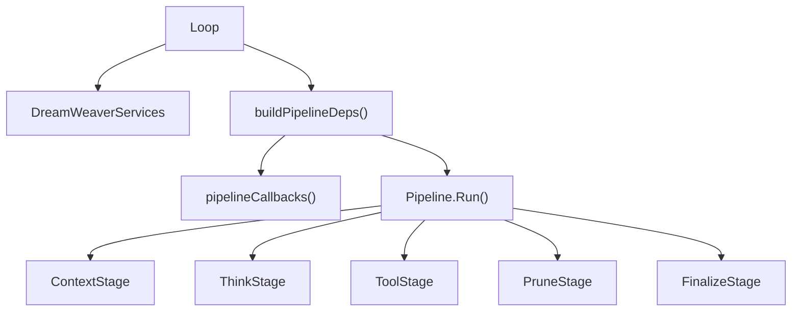

# 06 — 集成状态（Integration Status）

本文件聚焦一个问题：**DreamWeaver 应该如何深度接入 goclaw 的现有运行主链路。**

结论先行：

- 低风险接入点不是直接改 `internal/pipeline/`* 各 stage 的核心逻辑。
- 最优接线层是 `internal/agent/loop_pipeline_adapter.go` 中的 `buildPipelineDeps()` 与 `internal/agent/loop_pipeline_callbacks.go`。
- `Loop` 需要成为 DreamWeaver services 的 runtime 容器，`PipelineDeps` 需要成为 DreamWeaver 与 pipeline 之间的协议边界。

当前代码状态补充：

- 上述接线方式已经完成第一轮落地。
- `Loop` 已新增 DreamWeaver service 字段与 feature toggle。
- `buildPipelineDeps()` 已对 lifecycle / hooks / governor / compression / resume / sdk / prompt sections 做了第一层 wrapper。
- 这些能力当前不是默认开启，而是受 `DreamWeaverConfig` 控制。

---

## 一、接线总图

---

## 二、核心接线位置

### 2.1 `internal/agent/loop_types.go`

这是 DreamWeaver service 的持有层。`Loop` 在 `internal/agent/loop_types.go` 中除原有会话/工具/bus 外，已挂载 **DreamWeaver 运行时容器** 字段（在 `DreamWeaverConfig` 启用时参与 run）：

- `dreamweaverCfg`、`runtimeDB`
- `lifecycle.Manager`、`hooks.Registry`、`permissions.Governor`
- `compression.Engine`、`resume.Engine`
- `message.Transcript`（按 run 存在 `transcripts`）
- `sdk.Bridge`、`plugins.Registry`
- `spirit.ProfileManager`、`spirit.Router`、`spirit.LearningLoop`
- `consolidation.TopicWorker`、`consolidation.DailyLogWorker`

未改 pipeline stage 内核；行为主要通过 `buildPipelineDeps()` 的 callback wrapper 注入。

### 2.2 `internal/agent/loop_pipeline_adapter.go`

这是最关键的接线点。当前 `buildPipelineDeps()` 除下列外，还可映射 **ToolConcurrencySafe**（只读/并发安全工具分批并行）、Hook 对 tool 调用的阻断/改参、以及会话结束时的 DreamWeaver continuity 等：

- `BuildMessages`
- `CallLLM`
- `PruneMessages`
- `CompactMessages`
- `ExecuteToolCall` / `ExecuteToolRaw` / `ProcessToolResult`
- `FlushMessages`
- `EmitSessionCompleted`

DreamWeaver 深度融合应优先通过这里做 wrapper，而不是直接侵入 `pipeline` stage。这样有三个好处：

- pipeline stage 保持稳定
- DreamWeaver 可以按 feature toggle 渐进启用
- 回退成本低

### 2.3 `internal/agent/loop_pipeline_callbacks.go`

这里是现有 callback 的**底层实现集合**（返回给 `buildPipelineDeps` 的闭包）。**DreamWeaver 的包装**（hooks、resume、`sdkBridge.Emit`、Governor、governor 前序 hook 等）主要在 **`loop_pipeline_adapter.go`** 里对 `callLLM` / `executeToolCall` / `loadSessionHistory` 等再包一层，而不是写进 `makeCallLLM` 等函数体本身。例如：

- 在 **`loop_pipeline_adapter.go`** 包装 `callLLM`：pre/post think hooks、`sdkBridge` 事件
- 在同一文件包装 `executeToolCall`：Governor、Pre/Post Tool hooks、lifecycle
- 包装 **`loadSessionHistory` 的返回值**：`resumeEng.Resume`（`makeLoadSessionHistory` 本身仍只从 session 读 history）
- 在 `makeCompactMessages`（`loop_pipeline_callbacks.go`）或 adapter 中：`compressionEng.Compress` / `CompressToBudget`

---

## 三、按 stage 的具体接入点

### 3.1 `internal/pipeline/context_stage.go`

#### 当前职责

- `InjectContext`
- `ResolveWorkspace`
- `LoadContextFiles`
- `LoadSessionHistory`
- `BuildMessages`
- `AutoInject`

#### DreamWeaver 接入点

| 位置                   | 当前逻辑                       | DreamWeaver 接法                                              |
| -------------------- | -------------------------- | ----------------------------------------------------------- |
| `LoadSessionHistory` | 从 `sessions` 读取历史与 summary | 在 callback wrapper 中接 `resume.Engine`，先修复 history，再送入 stage |
| `BuildMessages`      | 拼 system + history         | 在 wrapper 中接 `message.Transcript` 与额外 prompt section        |
| `AutoInject`         | L0 memory recall           | 可在这里接 memory drift / DreamWeaver memory section             |

#### 建议

- `resume` 和 `message` 都不要直接写进 stage。
- 在 `buildPipelineDeps()` 提供包装过的 `LoadSessionHistory`、`BuildMessages` 即可。

### 3.2 `internal/pipeline/think_stage.go`

#### 当前职责

- 计算工具列表
- 构造 `ChatRequest`
- 调用 `CallLLM`
- 处理 truncation / parse error
- 追加 assistant tool-calling message

#### DreamWeaver 接入点

| 位置                   | 当前逻辑                     | DreamWeaver 接法                                                       |
| -------------------- | ------------------------ | -------------------------------------------------------------------- |
| `BuildFilteredTools` | 当前按已有 tool policy 构造工具列表 | 可叠加 spirit / plugin / governor 相关约束                                  |
| `CallLLM`            | 直接发请求                    | 在 callback wrapper 中接 `EventPreThink`、`EventPostThink`、lifecycle、sdk |
| `EmitBlockReply`     | 给前端发中间内容                 | 同时桥接到 `pkg/sdk` 事件流                                                  |

### 3.3 `internal/pipeline/tool_stage.go`

#### 当前职责

- 从 `LastResponse.ToolCalls` 取出 tool calls
- 顺序执行或并行执行工具
- 累加 tool count
- 做 exit condition 检查

#### DreamWeaver 接入点

| 位置                  | 当前逻辑                 | DreamWeaver 接法                                                        |
| ------------------- | -------------------- | --------------------------------------------------------------------- |
| `ExecuteToolCall`   | 直接调用工具执行路径           | 在 wrapper 中接 `Governor.Evaluate`、`EventPreToolUse`、`EventPostToolUse` |
| `ExecuteToolRaw`    | 并行 I/O               | 可在 raw path 前做只读/安全筛查                                                 |
| `ProcessToolResult` | 顺序处理 raw tool result | 可接 audit / sdk / transcript metadata                                  |
| `CheckReadOnly`     | 检查只读连续工具             | 可扩展为 DreamWeaver exit policy                                          |

#### 特别说明

`requires_action` 的最佳接法也在这里：当 `Governor` 返回 `ask` 时，runtime 应进入 awaiting state，而不是仅仅同步返回 deny。

### 3.4 `internal/pipeline/prune_stage.go`

#### 当前职责

- 计算 history budget
- 超过 soft threshold 时 `PruneMessages`
- 超过 budget 时 `CompactMessages`

#### DreamWeaver 接入点

| 位置                | 当前逻辑                       | DreamWeaver 接法                                 |
| ----------------- | -------------------------- | ---------------------------------------------- |
| `PruneMessages`   | 旧版 prune context           | 替换或包装为 DreamWeaver staged compression          |
| `CompactMessages` | 调 `compactMessagesInPlace` | 替换为 `compression.Engine.Compress()` 的 L2-L4 流程 |
| memory flush 前后   | 现有 flush                   | 可记录 hook / lifecycle / sdk compact state       |

### 3.5 `internal/pipeline/finalize_stage.go`

#### 当前职责

- sanitize content
- flush messages
- update metadata
- bootstrap cleanup
- maybe summarize
- emit session completed

#### DreamWeaver 接入点

| 位置                     | 当前逻辑               | DreamWeaver 接法                                            |
| ---------------------- | ------------------ | --------------------------------------------------------- |
| `FlushMessages`        | 落 session          | 可同步 transcript/resume state                               |
| `EmitSessionCompleted` | 发 consolidation 事件 | 可追加 lifecycle final state、sdk run.completed、learning loop |
| `MaybeSummarize`       | 触发现有 summarization | 可扩展 topic/daily consolidation trigger                     |

---

## 四、现有 `PipelineDeps` 可直接复用的能力

当前 `internal/pipeline/deps.go` 已经提供了几个非常适合 DreamWeaver 融合的槽位：

| 字段                     | 现状       | DreamWeaver 价值                                   |
| ---------------------- | -------- | ------------------------------------------------ |
| `EmitEvent`            | 已定义，使用较少 | 可以作为 lifecycle / sdk / hook event 的轻桥接入口         |
| `LoadSessionHistory`   | 已有       | `resume` 的最佳入口                                   |
| `BuildMessages`        | 已有       | `message` / prompt section 的最佳入口                 |
| `PruneMessages`        | 已有       | soft compression 的最佳入口                           |
| `CompactMessages`      | 已有       | hard compression 的最佳入口                           |
| `ExecuteToolCall`      | 已有       | governor / hooks / audit 的最佳入口                   |
| `EmitSessionCompleted` | 已有       | learning / consolidation / sdk final state 的最佳入口 |

这意味着：**不需要先重构 pipeline 才能做 DreamWeaver 深度融合。**

---

## 五、仍未改动的系统部分

即使完成当前深度融合，以下系统仍需要单独推进：

- **Gateway RPC / HTTP**：目前未新增 `dreamweaver.`* API。
- **数据库**：topic/daily/profile/audit/hook config 等表仍需 migration。
- **Web UI**：marketplace / workshop / spirit 设置页面仍未存在。
- **协议层**：`pkg/sdk.Client` 与网关现有 WS 帧结构仍需逐字段对齐。

---

## 六、推荐实施顺序

### 第一阶段：修库本身

1. `hooks` bug 与 typed payload
2. `sdk/bridge` per-run sequence
3. `permissions` 深化
4. `compression` 串联化
5. `message` lookup + UI reorder
6. `resume` state restore

### 第二阶段：接主链路

1. `Loop` 增加 DreamWeaver services
2. `buildPipelineDeps()` 做统一 wrapper
3. `tool` 路径接 governor + hooks + lifecycle
4. `context` 路径接 resume + transcript
5. `prune` 路径切换到 DreamWeaver compression
6. `finalize` 路径接 sdk + learning + consolidation trigger

### 第三阶段：做产品面

1. migrations
2. store 实现
3. plugin loading
4. marketplace API
5. spirit 入口

---

## 七、当前状态一句话

如果从“可 import”角度看，DreamWeaver 已经存在；如果从“真正进入 goclaw Runtime”角度看，**现在的核心状态仍然是：接线前夜，而不是融合完成。**

---

## Ideas：需求 2（本仓库代码变更追踪）

> 原载于 [DreamWeaver README](./README.md)「Ideas 需求索引」；与 CI/集成流程相关，放在集成状态文档。  
> **需求细化、分期验收、子系统映射与 NFR** 见 [08-goclaw-repo-tracking.md](./08-goclaw-repo-tracking.md)。

### 2. 实时追踪 goclaw 代码库更新

> 对本仓库 **goclaw** 的变更做持续追踪：罗列提交/合并带来的代码差异，评估价值与风险，并说明对现有模块与对外行为的影响。

**状态：🟢 基线已实现（P0–P1）**；托管 API 增强、PR 评论、Webhook 为 P2+（见 [08](./08-goclaw-repo-tracking.md) §9）。

| 子项               | 状态     | 说明                                                                                   |
| ---------------- | ------ | ------------------------------------------------------------------------------------ |
| 本仓库变更抓取          | 🟢 已实现 | **`goclaw changelog`**：`git log`、`git diff --name-status`、`git diff --stat`；`BASE_REF` / `HEAD_REF` |
| 变更价值评估           | 🟡 启发式 | **Risk flags**（路径规则：迁移、`pkg/`、权限/工具、网关 HTTP、前端、纯文档等）；非 LLM 深度分析 |
| 与模块映射            | 🟢 已实现 | **`internal/changelog/subsystems.yaml`** → 报告 **Files by subsystem** |
| 变更通知 / changelog | 🟡 可选 CI | Markdown  stdout；**`--json`**；可选 workflow 上传 artifact；IM / PR 机器人未内置 |

