# DreamWeaver（织梦）文档

本目录记录 **DreamWeaver** 在 goclaw 中的落地：在融合 Claude Code 类设计思想的前提下，**需求如何内化**、**已实现哪些能力**、**实现到什么程度**。

**说明**：原 **docs/claudecode/ideas.md** 中的「需求索引」与「§1 信息来源」已合并至本 README **下一节**；§1 各子系统对照表与条目进度见 [01](./01-agent-runtime-core.md)–[07](./07-deep-fusion-audit.md) 文末 `## Ideas：…` 段。

如果要看这次重新审视后的代码级判断，请先读：

- [07-deep-fusion-audit.md](./07-deep-fusion-audit.md)：从 Claude Code 机制对照、代码缺口、主链路接线三个角度重新判定当前完成度。
- [06-integration-status.md](./06-integration-status.md)：给出 `Loop -> buildPipelineDeps -> pipeline stages` 的具体接入位置。
- [TODO.md](./TODO.md)：合并待办清单（与各分册 Ideas 表交叉引用；含已实现/已核对项）。

---

## Ideas 需求索引

> 本节为原 **docs/claudecode/ideas.md** 全文并入；**以后维护**以本 README 为准。

### 需求索引

| # | 主题 | 详见 DreamWeaver 文档 |
|---|------|------------------------|
| 1 | 融合 Claude Code 设计（§1 A–L 对照表） | [01](./01-agent-runtime-core.md)（A/B/C/J）、[02](./02-runtime-continuity.md)（E/F/G）、[03](./03-extension-protocol.md)（D/H/I/K）、[07](./07-deep-fusion-audit.md)（L） |
| 2 | 实时追踪 goclaw 代码库更新 | [08-goclaw-repo-tracking](./08-goclaw-repo-tracking.md)（集成进度见 [06](./06-integration-status.md)） |
| 3–5 | 市场 / 织梦坊 / everything-cli | [04-ecosystem](./04-ecosystem.md) |
| 6 | 精灵功能 | [05-spirit](./05-spirit.md) |
| — | 融合优先级（P0–P3） | [07-deep-fusion-audit](./07-deep-fusion-audit.md) |
| — | 合并待办（可勾选） | [TODO.md](./TODO.md) |

### §1 信息来源（融合表）

- `docs/claudecode/Open-ClaudeCode-main/analysis`（16 篇子系统分析）
- `docs/claudecode/ClaudeCode-Source-Analysis-main/HitCC/docs`（81 篇逆向行为分析）
- `docs/claudecode/Claudecode-analysis/src`（TS 源码摘录）

以上路径说明随 §1 各表写在对应 DreamWeaver 文档章节中（自 [01](./01-agent-runtime-core.md) 起）。

---

## 一、需求内化（本轮实现要解决什么）

DreamWeaver 的总体目标，是把 goclaw 从「Agent 网关」推向 **Agent Runtime 平台**：在保留现有网关、管线、存储的前提下，补齐 **生命周期与可观测性**、**多视图消息与恢复**、**工具级权限治理**、**长上下文分层治理**、**标准化扩展（Hook / SDK / 插件）**、**生态（市场 / 织梦坊 / 炼化）** 与 **精灵式编排**。

内化后的能力分层如下：

| 层级 | 需求摘要 | 本轮是否覆盖 |
|------|----------|--------------|
| **A. 运行时核心** | Run 级状态机、消息多视图、权限治理链、会话恢复（非简单回放） | **Go 库** + 已在 `Loop` / `buildPipelineDeps` callbacks 中接线；由 **`DreamWeaverConfig` 特性开关** 控制，**默认关闭** |
| **B. 连续性** | 分层压缩（L0–L4）、主题/日粒度记忆、记忆与上下文漂移检测 | 压缩与 topic/daily **已** 接主链路与 PG（开关控制）；**漂移**：`CheckDrift` 与 **漂移后 L0 刷新**在 **`DreamWeaverConfig.Enabled` + episodic auto-inject** 时已接（经 `ContextStage` 的 AutoInject / pipeline 回调路径，非独立 Stage 名） |
| **C. 扩展协议** | Hook 生命周期、SDK 事件与命令、插件 manifest 与生命周期 | 库完整；进程内 WebSocket Bridge + **远程 SSE**（`/v1/bridge/events`）；**逐字段**协议规范文档仍待补齐 |
| **D. 生态** | 市场索引与安装、织梦坊生成物、GitHub 炼化为插件 | **已** 网关市场 HTTP、PG 目录、`marketplace_entitlements` 权益校验、可选对象存储、`marketplace` Web UI、`goclaw marketplace push`；**无** 独立「市场云」控制面产品与内置支付收单（Stripe 等外接） |
| **E. 精灵** | 用户画像、意图路由、多 Agent 编排、反馈学习 | **已** `PGSpiritProfileStore`、LLM 路由、编排委托、`POST /v1/feedback`；**已** **`/dreamweaver`** 能力面板（精灵 V3 flags 等） |

**未纳入或仍属愿景的需求**：

- **第 2 条**（Ideas 索引）：本仓库变更追踪 — **P0–P1 已落地**：`goclaw changelog`（`git log` / `name-status` / `--stat`）、`internal/changelog/subsystems.yaml` 子系统映射、启发式风险标签、`--json`；托管 API 增强与 PR 评论仍为 P2+（需求见 [08](./08-goclaw-repo-tracking.md)）。
- **第 5 条**：everything-cli 转为 goclaw 模块 — **未实现**。
- **企业级产品形态**：独立 SaaS 运营后台、内置支付与税务合规、炼化 CI 强沙箱 — **未**；当前为 **可部署网关 + PG**：多租户上下文、`marketplace_entitlements`、安装前 **`HasEntitlement`**、试用/Stripe webhook（见 `internal/http/marketplace_extra.go`）、**定价模型校验**（见 Phase 2 / [04-ecosystem](./04-ecosystem.md) §1.5.1）。

---

## 二、实现程度总览（一句话）

| 维度 | 结论 |
|------|------|
| **代码形态** | 以 **`internal/*` 与 `pkg/sdk`** 为主，**可编译、可单测**的库；**不是**默认开启的产品特性开关。 |
| **与现有系统** | 已新增一轮 `Loop -> buildPipelineDeps -> pipeline callbacks` 的深度接线，但当前以 `DreamWeaverConfig` 为特性开关、默认关闭；详见 [06-integration-status.md](./06-integration-status.md) 与 [07-deep-fusion-audit.md](./07-deep-fusion-audit.md)。 |
| **数据持久化** | DreamWeaver 运行时表已有 5 张（`hook_configs`、`audit_log`、`spirit_profiles`、`topics`、`daily_logs`），见 `migrations/000050_*`。PG Store：`PGTopicStore`、`PGDailyLogStore`、`PGSpiritProfileStore`、`PGPermissionAuditStore`、`PGHookConfigStore`（见 `internal/store/pg/dreamweaver.go`）。**市场目录**：启用 PostgreSQL 时以 **`marketplace_packages` 等为权威**，并与 **`{dataDir}/marketplace/catalog.json` 双写**（见 Phase 2-7）。SDK 事件：进程内 Bridge + 远程可订阅 SSE。 |
| **UI** | **`ui/web`**：`marketplace/`（列表/搜索/详情/安装/互动）；**`/dreamweaver`**（桥接说明、分层配置、**`/dreamweaver/workshop`** 分步向导、炼化入口、精灵 V3 flags）。 |

---

## 实现与融合（补充）

### 已实现但未融合（清单）

下列能力 **代码已存在**，但与 **默认 agent run**、**完整产品形态** 或 **跨会话策略** 尚未完全融合（或有意保持关闭）。

| 类别 | 项 | 说明 |
|------|-----|------|
| **默认策略** | 整块 DreamWeaver 接线 | 已在 `Loop` / `buildPipelineDeps` 中实现，**默认关闭**（`DreamWeaverConfig`），避免破坏现有运行。 |
| **运行时库** | `internal/lifecycle` 独立用法 | 状态机 **完整库**；主路径通过 `transitionLifecycle` 与 `loop_pipeline_adapter` **同步**，**非** pipeline 内嵌 Stage。 |
| **运行时库** | `internal/message` 多视图 | 未替换 `MessageBuffer` 默认路径；Transcript/多视图 **旁路** 使用。 |
| **连续性** | `CheckDrift` 后 **改写 system 记忆段** | **已** 在漂移检测后 **剥离旧 L0 块并重跑** `AutoInjector`（见「已部分融合」）。 |
| **扩展** | SDK 与网关 **逐字段** 协议 | [sdk-remote-bridge.md](./sdk-remote-bridge.md) 描述 **EventFrame / SSE**；WebSocket 命令帧仍以网关与 `pkg/sdk` 为准。 |
| **生态 / UI** | 织梦坊分步向导页 | **`/dreamweaver/workshop`** 四步向导（目标 → 准备 → 跳转创建 → 完成）；深度表单仍可在 Skills/Agents 页扩展。 |
| **生态 / CI** | 炼化沙箱与一键发布 | **冒烟**：`scripts/alchemy-smoke.sh` / `.ps1`；全链路发布需团队 CI 编排（见 [alchemy-pipeline.md](./alchemy-pipeline.md)）。 |
| **愿景** | Ideas 第 2 条托管 API / PR 机器人 / 通知 | [08](./08-goclaw-repo-tracking.md) P2+；**基线** 已有 `goclaw changelog` + 映射 + 风险标签 + JSON。 |
| **愿景** | everything-cli 模块 | **未实现**；路线图见 [everything-cli-roadmap.md](./everything-cli-roadmap.md)。 |
| **愿景** | 独立「市场云」控制面 / 内置支付与税务 / Run 侧计费全覆盖 | 当前为网关内目录 + **`marketplace_entitlements`** + 外部 Stripe + Install 侧 **`InstallBlockedByPricing` / HasEntitlement**（见 [04](./04-ecosystem.md) §1.5.1）。 |

### 已在主链路部分融合（代码）

| 项 | 说明 |
|----|------|
| **记忆漂移（跟踪 + 检测 + 刷新）** | **`DreamWeaverConfig.Enabled`** 且 **episodic auto-inject** 时：`RecordInjection` / `Tick` / `ShouldRefresh` 后 **`CheckDrift`**；漂移时 **剥离** 原 `MemorySection`、**重跑** `AutoInjector`、更新 **`OverheadTokens`**。 |

---

## 三、分模块：实现了什么、到什么程度

### 3.1 Phase 1 — 运行时核心

| 能力 | 包 | 实现内容 | 程度 |
|------|-----|----------|------|
| 生命周期状态机 | `internal/lifecycle` | 状态枚举、合法迁移、`Manager`、历史、可选 `eventbus` 发布、单元测试 | **完整库**；主路径经 **`transitionLifecycle`** 与 pipeline 同步（非独立 Stage） |
| 多视图消息 | `internal/message` | Transcript/API/UI/Resume 视图、`Normalize*`、`Transcript` 封装 | **完整库**；未替换 `MessageBuffer` 默认路径 |
| 权限治理 | `internal/permissions`（governor + classifier） | 规则/模式/分类、审批回调、审计日志、Hook 挂钩点 | **完整库**；PG 审计已有；与 RBAC **并存**；**`GovernorEnabled` 打开时** 工具路径走 `Governor`（见 Phase 0-3） |
| 会话恢复 | `internal/resume` | 过滤、配对修复、continuation、中断类型；单测 | **完整库**；DreamWeaver 启用时 **已** 在 `buildPipelineDeps` / `loop_pipeline_adapter.go` 中对 `loadSessionHistory` 外包 `resumeEng.Resume`（Phase 0-5） |

### 3.2 Phase 2 — 连续性

| 能力 | 包 | 实现内容 | 程度 |
|------|-----|----------|------|
| 分层压缩 | `internal/compression` | L0–L4 策略、`Engine`、阈值、单测 | **已** 通过 `buildPipelineDeps` → `CompactMessages` 接入（受 `DreamWeaverConfig` 控制） |
| 主题记忆 | `internal/consolidation`（topic_worker） | `TopicWorker`、wikilink 辅助、存储/抽取器接口 | PG Store + worker **已** 在 `initDreamWeaverServices` 中初始化；会话结束路径触发 consolidation（见 `persistDreamWeaverContinuity`） |
| 每日日志 | `internal/consolidation`（daily_log） | `DailyLogWorker`、摘要器接口 | 同上 |
| 记忆漂移 | `internal/memory`（drift_detector、lexical scorer） | `DriftDetector`、刷新判定 | **完整库**；**已** `RecordInjection` + `Tick` + `CheckDrift` + **漂移后重注入 L0**（`applyMemoryDriftRefresh`） |

### 3.3 Phase 3 — 扩展协议

| 能力 | 包 | 实现内容 | 程度 |
|------|-----|----------|------|
| Hook | `internal/hooks` | 事件类型、注册表、同步/异步、webhook/command/internal | **完整库**；DreamWeaver 启用时 **已** 在 LLM/tool 路径 `Fire`（Phase 0-6） |
| SDK / Bridge | `pkg/sdk` | 事件类型、`Bridge`、WebSocket `Client`、**SSE** 远程客户端 | 与网关 **已** 可连；**EventFrame + SSE** 见 [sdk-remote-bridge.md](./sdk-remote-bridge.md) |
| 插件 | `internal/plugins` | Manifest、Install/Configure/Activate/…、`LoadFromDir` | **完整库**；安装激活后 **已** 经 registry 调用真实 handler（Phase 0-8） |

### 3.4 Phase 4 — 生态

| 能力 | 包 | 实现内容 | 程度 |
|------|-----|----------|------|
| 市场 | `internal/marketplace`、`internal/http/marketplace.go`、`cmd/marketplace_cmd.go`、`ui/web/.../marketplace/` | 目录、搜索、安装（git + ref）、`installed.json`、PG 权威 + JSON 备份、`import`/`push`、可选 S3、网关 HTTP、Web UI | **库 + CLI + 网关 + PG + UI**；收费依赖 **外部 Stripe** + 本仓库 **权益 / 定价校验** |
| 织梦坊 | `internal/workshop` | Skill/Agent 生成、`Publisher`、远程 push | **库级** + 发布链路 + Web **`/dreamweaver/workshop`** 向导 |
| 炼化 | `internal/alchemy` | 仓库分析、manifest + Go wrapper 生成 | Go wrapper **可编译**；**冒烟脚本** [alchemy-pipeline.md](./alchemy-pipeline.md) |

### 3.5 Phase 5 — 精灵

| 能力 | 包 | 实现内容 | 程度 |
|------|-----|----------|------|
| 画像 | `internal/spirit`（profile） | `Profile`、`ProfileManager`、接口 `ProfileStore` | **完整库**；`RuntimeDB` 可用时使用 `PGSpiritProfileStore` |
| 路由 | `internal/spirit`（router） | LLM `IntentClassifier`（`spirit_enabled` 时）、关键词回退、`AgentInfo` 绑定 | **完整库** + 主链路接线（见 Phase 3-1） |
| 编排 | `internal/spirit`（orchestrator） | 依赖图、并行执行、`AgentExecutor`/`ResultMerger`、委托至 `Loop` | **完整库** + 多 SubTask 时执行并合并（见 Phase 3-3） |
| 学习 | `internal/spirit`（learning） | `LearningLoop`、`Feedback`、亲和度更新 | **完整库** + **`POST /v1/feedback`**（见 Phase 3-2） |

---

## 四、功能清单（已实现 / 未实现）

### 已实现（库内功能）

- [x] 生命周期状态迁移校验与历史、事件发布（可选）
- [x] 多视图消息归一化与 transcript 视图导出
- [x] 工具级权限治理（规则 + 模式 + 分类 + 审计 + 审批钩子）
- [x] 会话恢复：孤儿 tool 修复、continuation、中断分类
- [x] 五层压缩引擎（L0–L4）与阈值触发
- [x] 主题记忆与日日志 **数据结构 + worker 骨架**（存储/摘要外置）
- [x] 记忆漂移：**注入记录 + 迭代 Tick + `CheckDrift` + 漂移后重跑 auto-inject 更新 system**（DreamWeaver 开 + auto-inject）
- [x] Hook 注册与执行（webhook/shell/internal）
- [x] SDK 事件模型、Bridge、WebSocket Client 骨架
- [x] 插件 manifest 与生命周期、目录扫描安装
- [x] 市场 catalog、搜索、评论、git 安装器
- [x] 织梦坊：SKILL.md / agent JSON 生成、发布到 catalog
- [x] 炼化：clone + 结构分析 + Go wrapper 生成（可编译加载；沙箱/发布流水线仍缺）
- [x] 精灵：画像、路由、编排、学习闭环 **逻辑层**

### 未实现或仅部分（与文末 Phase 状态表对齐；此处为**增量缺口**清单）

- [x] 已在 `Loop` / `buildPipelineDeps()` / prompt builder 中接入 DreamWeaver wrapper，当前以 `DreamWeaverConfig` 控制启用
- [ ] 网关 / 管线 **默认开启** 上述能力（**有意**保持特性开关，默认关闭，避免破坏现有 run）
- [x] 数据库表与迁移（`migrations/000050_*`：hook_configs / audit_log / spirit_profiles / topics / daily_logs）
- [x] PG Store：TopicStore / DailyLogStore / SpiritProfileStore / PermissionAuditStore / HookConfigStore（`internal/store/pg/dreamweaver.go`）
- [x] `hook_configs` 的 Go Store 与启动时从 DB 加载到 `hooks.Registry`（见 `loadDreamWeaverHooks`）
- [x] 市场目录 **PG 权威** + `catalog.json` 备份（PostgreSQL 时，见 Phase 2-7）
- [x] Web UI：**市场**（Phase 2-8）+ **`/dreamweaver`** 能力面板 + **`/dreamweaver/workshop`** 织梦坊向导（Phase 6 延伸）
- [ ] 本仓库变更 **托管 API / PR 机器人 / LLM 影响摘要**（ideas 第 2 条扩展 / [08](./08-goclaw-repo-tracking.md) P2+）；**基线已做**：`goclaw changelog`、子系统映射、启发式 risk、`--json`（Phase 5-4/5-5）
- [ ] everything-cli 模块（ideas 第 5 条）
- [x] 市场上传：`goclaw marketplace push` 深校验 + 分片/断点续传 + 网关 staging + **可选 S3**（Phase 2-1）
- [ ] **独立** 多租户「市场云」控制面（与「**单网关实例** 即目录服务」相区别）；对象存储 / 审核 webhook **已** 可按配置启用
- [x] 市场消费：评论/点赞/安装；**`marketplace_entitlements`**；试用 / 手动授权 / Stripe webhook；安装前 **定价模型校验**（`ValidatePricingModel`）；收单仍在外部 Stripe
- [ ] **企业级** 许可证服务器、内置支付、Run 侧计费策略全覆盖；**已有**：Install 侧定价与权益、外部 Stripe 契约
- [ ] 炼化：**完整** CI 发布流水线（仓库级）；**已有** 冒烟脚本 + 单测编译 wrapper
- [x] SDK 远程桥：**EventFrame / SSE** 说明见 [sdk-remote-bridge.md](./sdk-remote-bridge.md)；WS 命令帧以 `pkg/sdk` + 网关为准
- [ ] [08](./08-goclaw-repo-tracking.md) 所述 **完整** 追踪工具链（超出 `changelog` CLI 的部分）

---

## 五、文档索引

| 文档 | 内容 |
|------|------|
| [01-agent-runtime-core.md](./01-agent-runtime-core.md) | 运行时核心：生命周期、多视图消息、权限治理、会话恢复 |
| [02-runtime-continuity.md](./02-runtime-continuity.md) | 运行时连续性：分层压缩、主题记忆、每日日志、记忆漂移 |
| [03-extension-protocol.md](./03-extension-protocol.md) | 扩展协议：Hook、SDK/Bridge、插件清单与生命周期 |
| [04-ecosystem.md](./04-ecosystem.md) | 生态：市场、织梦坊、炼化（GitHub → 插件） |
| [05-spirit.md](./05-spirit.md) | 精灵：用户画像、意图路由、编排、学习闭环 |
| [06-integration-status.md](./06-integration-status.md) | 集成状态与建议接入顺序 |
| [07-deep-fusion-audit.md](./07-deep-fusion-audit.md) | 深度融合审计：当前代码与 Claude Code 机制的差距、主链路接线位置、真实完成度判定 |
| [08-goclaw-repo-tracking.md](./08-goclaw-repo-tracking.md) | 追踪本仓库变更：抓取、分类、子系统映射、产物与分期验收 |
| [sdk-remote-bridge.md](./sdk-remote-bridge.md) | SDK 远程桥：`EventFrame`、SSE `/v1/bridge/events`、鉴权与心跳 |
| [alchemy-pipeline.md](./alchemy-pipeline.md) | 炼化冒烟脚本与流水线说明 |
| [everything-cli-roadmap.md](./everything-cli-roadmap.md) | everything-cli（ideas 第 5 条）路线图占位 |

---

## 六、与 ideas 条目的落地映射（细化）

| ideas 条目 | 主要落地 | 完成度（本轮） |
|---------------|----------|----------------|
| 1. 融合 claudecode 设计并实现 | 各子文档 + [Claudecode 分析](../claudecode/Claudecode-analysis/README.md) | **设计落地为库**；DreamWeaver 已通过 `Loop`/`buildPipelineDeps` **部分接入主链路**（特性开关，见 [06](./06-integration-status.md)） |
| 2. 追踪源库更新 | [08](./08-goclaw-repo-tracking.md)、`goclaw changelog` | **P0–P1 已落地**（changelog CLI、子系统映射、启发式 risk、`--json`）；**托管 API / PR 机器人 / 深度影响评估** 见 [08](./08-goclaw-repo-tracking.md) P2+ |
| 3. 市场 | `internal/marketplace`、`cmd/marketplace_cmd.go`、`internal/http/marketplace.go`、`ui/web/.../marketplace/` | **库 + import/push + PG 目录 + 网关 HTTP + UI + 权益/试用/Stripe 契约**；无独立 SaaS 控制面 |
| 4. 织梦坊 | `internal/workshop`、`/dreamweaver`、`/dreamweaver/workshop` | **库 + 远程发布** + Web **分步向导**（`/dreamweaver/workshop`） |
| 5. everything-cli 模块 | — | **未做** |
| 6. 炼化 | `internal/alchemy`、冒烟脚本 | **分析 + 可编译 Go wrapper**；**完整** CI 发布流水线仍 **未做**（见 [alchemy-pipeline.md](./alchemy-pipeline.md)） |
| 7. 精灵 | `internal/spirit`、`loop_dreamweaver.go`、`internal/http/feedback.go`、`/dreamweaver` | **LLM 路由 + feedback API + 编排委托 + topic 同步 + Web 能力面板**（特性开关） |

---

## 架构总览

```mermaid
flowchart LR
    subgraph P1 [Phase1_RuntimeCore]
        LC[lifecycle]
        MM[message]
        PG[permissions]
        RS[resume]
    end
    subgraph P2 [Phase2_Continuity]
        CP[compression]
        CO[consolidation]
        ME[memory]
    end
    subgraph P3 [Phase3_Extension]
        HK[hooks]
        SDK[sdk]
        PL[plugins]
    end
    subgraph P4 [Phase4_Ecosystem]
        MK[marketplace]
        WS[workshop]
        AL[alchemy]
    end
    subgraph P5 [Phase5_Spirit]
        SP[spirit]
    end
    P1 --> P2
    P2 --> P3
    P3 --> P4
    P4 --> P5
```

在总览文档中也可从 [00-architecture-overview.md](../00-architecture-overview.md) 的「Cross-References」表跳转到本目录。

---

## 文档与代码一致性审计（摘要）

> 对 Phase 0～6 实施计划与当前代码的交叉核对：**所列能力均已实现**；下表仅记录 **文档原表述与代码位置/条件** 的差异，便于维护（非功能缺失）。

| 勘误点 | 原文档易误解处 | 实际代码 |
|--------|----------------|----------|
| **0-1 ProfileStore** | 「DB + `SpiritEnabled` 才用 PG」 | `runtimeDB != nil` 时 `initDreamWeaverServices` 即选用 `PGSpiritProfileStore`；**`SpiritEnabled` 控制精灵提示段与 LLM 分类器**，不决定是否使用 PG Store |
| **0-3 审计** | `Governor.OnDecision` | `Governor.Evaluate` → `recordAndNotify` → `PGPermissionAuditStore.AppendAuditEntry`（无名为 `OnDecision` 的 API） |
| **0-5 Resume** | 在 `makeLoadSessionHistory` 内调用 resume | `makeLoadSessionHistory` 仍只读 session；**`resumeEng.Resume`** 在 `buildPipelineDeps` / **`loop_pipeline_adapter.go`** 中对返回的 history 做包装 |
| **0-6 Hooks** | 在 `loop_pipeline_callbacks.go` 的 `makeCallLLM` / `makeExecuteToolCall` 内 | **Pre/Post Think、Pre/Post Tool** 在 **`loop_pipeline_adapter.go`** 包装 `callLLM` / `executeToolCall` 时 `Fire` |
| **0-7 SDK Emit** | 含 `loop_pipeline_callbacks.go` | 主要为 **`loop_dreamweaver.go`**（lifecycle / `OnTransition`）与 **`loop_pipeline_adapter.go`**（tool、permission、run 收尾等） |
| **1-4 JSONL** | `message.Transcript` 写 JSONL | **`Loop.writeTranscriptJSONL`** 写 `{dataDir}/transcripts/{runID}.jsonl`；`internal/message.Transcript` 仍为 **内存** 视图 |
| **3-4 topics** | Loop 内直接 `UpsertTopic` | 纠错含 `correction` 时在 **`internal/spirit/learning.go`** 调用 `PGTopicStore.UpsertTopic`；`LearningLoop.BindTopicStore` 在 **`loop_dreamweaver.go`** |

---

## 实施计划

> 基于上文所有文档审计后的事实产出。**每个阶段自包含**（对 Agent 或开发者可直接执行），后一阶段可在前一阶段合并后再启动。代码锚点均指向当前仓库真实路径。

### Phase 0 — 接线激活（让已有库进主链路）

**目标**：把「可 import」变为「参与 agent run」，以 feature toggle 渐进启用，不改 pipeline stage 内核。

| # | 任务 | 代码入口 | 验收 |
|---|------|----------|------|
| 0-1 | **Spirit ProfileStore 接线**：`runtimeDB != nil` 时 `initDreamWeaverServices()` 使用 `PGSpiritProfileStore`；无 DB 时为 `noopProfileStore`。**`SpiritEnabled` 不切换 Store**，仅控制精灵提示与 LLM 路由 | `loop_dreamweaver.go`（`initDreamWeaverServices`） | 有 PG 时 `dreamweaver_spirit_profiles` 可写入；重启后画像可恢复 |
| 0-2 | **TopicStore / DailyLogStore 注入**：`TopicWorker` 与 `DailyLogWorker` 用 `PGTopicStore` / `PGDailyLogStore`；在 `EmitSessionCompleted` 回调触发 | `loop_pipeline_callbacks.go` → `makeEmitSessionCompleted`；`consolidation/` | 完成一次 session 后 `dreamweaver_topics` / `dreamweaver_daily_logs` 有记录 |
| 0-3 | **PermissionAuditStore 注入**：`Governor.Evaluate` 决策经 `recordAndNotify` → `PGPermissionAuditStore.AppendAuditEntry` | `governor.go`；`loop_dreamweaver.go`（`SetAuditStore`） | `DreamWeaverConfig.GovernorEnabled` 启用后，`dreamweaver_audit_log` 有行 |
| 0-4 | **Compression 接 PruneStage**：`makeCompactMessages()` wrapper 使用 `compressionEng.Compress()` 替代旧 `compactMessagesInPlace`（另见 adapter 中 `CompressToBudget` 路径） | `loop_pipeline_callbacks.go` → `makeCompactMessages`；`loop_pipeline_adapter.go` | 会话超阈值时走 L0–L4 策略 |
| 0-5 | **Resume 接 ContextStage**：在 **`buildPipelineDeps` / `loop_pipeline_adapter.go`** 中对 **`loadSessionHistory` 的返回值** 外包 `resumeEng.Resume`，而非在 `makeLoadSessionHistory` 函数体内 | `loop_pipeline_adapter.go`（wrap `loadSessionHistory`） | 中断后 `--continue` 不含孤儿 tool |
| 0-6 | **Hooks Fire 接主链路**：在 **`loop_pipeline_adapter.go`** 包装 LLM / tool 调用处 `Fire` `EventPreThink` / `EventPostThink` / `EventPreToolUse` / `EventPostToolUse` | `loop_pipeline_adapter.go` | 注册 internal handler → 日志可见事件序列 |
| 0-7 | **SDK Bridge Emit**：lifecycle（`loop_dreamweaver.go` `OnTransition`）、tool / permission / run 收尾（`loop_pipeline_adapter.go`）等处 `sdkBridge.Emit` | `loop_dreamweaver.go`；`loop_pipeline_adapter.go` | SDK `Client` 连接后可收到事件流 |
| 0-8 | **Plugin 真实 dispatch**：激活路径注册 **`pluginRuntimeTool`**，`Execute` → `pluginRegistry.ExecuteTool`（非空占位） | `loop_dreamweaver.go`；`plugins/registry.go` | 安装含 tool 的插件后可返回真实结果 |

**Phase 0 状态（代码核对）**：上表 0-1～0-8 **均已落地**（`internal/agent/loop_dreamweaver.go`、`internal/agent/loop_pipeline_adapter.go`、`internal/agent/loop_pipeline_callbacks.go`、`internal/permissions/governor.go`、`internal/store/pg/dreamweaver.go`）。

**产出**：全部通过后，`DreamWeaverConfig{ Enabled:true, ... }` 可逐项打开，goclaw 进入 **DreamWeaver Runtime** 模式。

---

### Phase 1 — 核心循环强化

**目标**：补齐 Claude Code 对照中 P0 级缺口。

| # | 任务 | 参考文档 | 验收 |
|---|------|----------|------|
| 1-1 | **流式并发 tool 执行**：`ToolStage` 可按 `isConcurrencySafe` 标记对 readonly 工具并行 | [01 §A](./01-agent-runtime-core.md)（`StreamingToolExecutor`） | 两个 read_file 同时发起而非串行 |
| 1-2 | **同步 Hook 阻断**：`hooks.Fire` 支持 `sync` 模式，PreToolUse hook 可返回 `block` 或注入修改 | [03 §D](./03-extension-protocol.md)（Hook 可阻断） | hook handler 返回 `{block:true}` 时工具不执行 |
| 1-3 | **Reactive compact**：上下文超 `contextWindow * 0.8` 时自动触发 `compression.Engine`，而非仅 PruneStage | [02 §F](./02-runtime-continuity.md)（reactiveCompact） | think 阶段超限不报错而是压缩后重试 |
| 1-4 | **JSONL Transcript 持久化**：`Loop.writeTranscriptJSONL` 将消息序列追加到 `{dataDir}/transcripts/{runID}.jsonl`（`internal/message.Transcript` 仍为内存视图） | [02 §G](./02-runtime-continuity.md)（JSONL） | 磁盘上存在对应 jsonl；`--resume` 行为以 session 存储为准 |
| 1-5 | **HookConfigStore**：为 `dreamweaver_hook_configs` 表实现 Go Store，`hooks.Registry` 启动时从 DB 加载 | `migrations/000050_*` | 配置写入 DB 后重启仍生效 |

**Phase 1 状态（代码核对）**：上表 1-1～1-5 **均已落地**（`internal/pipeline/tool_stage.go`、`think_stage.go`、`loop_pipeline_adapter.go`、`loop_dreamweaver.go`、`internal/store/pg/dreamweaver.go`）。

---

### Phase 2 — 市场生态（上传 / 云 / 审核 / 下载）

**目标**：自有上传/下载工具 + 云托管 + 外部审核 + 市场消费闭环。

| # | 任务 | 参考文档 | 验收 |
|---|------|----------|------|
| 2-1 | **上传 CLI**：`goclaw marketplace push` 子命令；本地核检（manifest schema / 大小 / 禁止路径）；带 FR-U3 属性元数据；HTTPS 分块上传到云 | [04 §1.1.2](./04-ecosystem.md) | 核检失败不上传；通过后云端暂存桶有制品 |
| 2-2 | **云目录 API**：`GET /v1/marketplace/packages`（搜索/分页/排序）、`POST /v1/marketplace/packages`（注册/更新） | [04 §1.2 FR-M1–M5](./04-ecosystem.md) | curl 调通且租户隔离 |
| 2-3 | **Install ref pin**：`Installer.Install` 支持 `git clone -b <tag>` 或 `--single-branch` + checkout | [04 §1.3 FR-L1](./04-ecosystem.md) | 指定 v1.0.0 安装后 `.git/HEAD` 指向该 ref |
| 2-4 | **installed.json 清单**：安装后写清单，`ListInstalled` 读清单而非扫目录 | [04 §1.3 FR-L3](./04-ecosystem.md) | 清单与磁盘一致 |
| 2-5 | **审核回调契约**：云侧暴露 `PATCH /v1/marketplace/packages/{id}/review`（approve/reject）；通过后状态 → `published` | [04 §1.1.4 FR-R1–R3](./04-ecosystem.md) | reject 时作者 GET 可见原因 |
| 2-6 | **市场消费 API**：`POST /v1/marketplace/packages/{id}/review`（评论）、`POST /v1/marketplace/packages/{id}/like`（点赞）、付费校验中间件 | [04 §1.1.5](./04-ecosystem.md) | 评论落库；未付费包 Install 返回 403 |
| 2-7 | **Catalog 持久化**：将 `Catalog` 从内存 map 迁到 DB 或嵌入式存储，支持重启恢复与云同步 | [04 §1.4](./04-ecosystem.md) | 重启后 Search 结果一致 |
| 2-8 | **Web UI 市场页**：列表/搜索/详情/安装/评论/评分 | [04 §4](./04-ecosystem.md) | 浏览器可操作 |

**Phase 2 状态（代码核对）**：**已完成**（2-1～2-8 见下表）。

| 项 | 状态 | 说明 |
|----|------|------|
| 2-1 | 已 | `goclaw marketplace push` 已具备：本地深校验（Skill/Plugin/MCP schema + 聚合错误）、单请求与分片断点续传上传（`/upload/chunk` + `/upload/complete`）、制品 `sha256/size` 校验、以及可配置 S3 兼容对象存储落盘（回写 `artifact_uri`/校验信息） |
| 2-2 | 已 | `GET/POST /v1/marketplace/packages`、详情与租户过滤；**`GET /v1/marketplace/catalog-export`** 导出与 `CatalogSnapshot` 等价的 JSON（边缘/灾备同步）；网关 + PostgreSQL 时目录以 **PG 为权威**（`marketplace_packages` / `marketplace_reviews`），并 **同步写 `catalog.json`** 备份；独立部署时网关即「云目录」服务 |
| 2-3 | 已 | `Package.Ref` + `Installer` 在 staging 目录 clone 后 `fetch` + `checkout` 指定 ref |
| 2-4 | 已 | `{dataDir}/packages/installed.json`；`ListInstalled` 优先读清单 |
| 2-5 | 已 | `PATCH .../review`（审核）；**`marketplace_audit_events`** 审计表；**`GOCLAW_MARKETPLACE_REVIEW_WEBHOOK_URL`**（可选 `..._SECRET`）外部回调；**`GOCLAW_MARKETPLACE_ALLOW_TENANT_PUBLISH=true`** 时上传路由降为 **Operator+**（否则默认 Admin） |
| 2-6 | 已 | 评论/点赞/安装；**`marketplace_entitlements`** + `HasEntitlement`；**`POST .../trial`**（`trial_days`）、**`POST .../purchase`**（`GOCLAW_MARKETPLACE_MANUAL_PURCHASE_SECRET` 或 **`GOCLAW_MARKETPLACE_DEV_GRANT_PURCHASE=true`** 开发授权）、**`POST /v1/marketplace/webhooks/stripe`**（`X-Goclaw-Webhook-Secret` + `GOCLAW_MARKETPLACE_WEBHOOK_STRIPE_SECRET`，`checkout.session.completed` 元数据写入权益）；仍由外部 Stripe 收单，本仓库仅契约与落库 |
| 2-7 | 已 | PG 表 **`marketplace_packages` / `marketplace_reviews`**；启动时 PG 为空则 **从 `catalog.json` 迁移**；每次变更 **双写 PG + JSON** |
| 2-8 | 已 | **`readme_markdown`** 字段 + 详情页 **ReactMarkdown**；试用 / 开发授权按钮；**`marketplace` i18n**（en/zh/vi）覆盖列表与详情主文案 |

---

### Phase 3 — 精灵闭环

**目标**：Spirit 从「提示块增强」升级为「调度 + 学习闭环」。

| # | 任务 | 参考文档 | 验收 |
|---|------|----------|------|
| 3-1 | **IntentClassifier 注入**：用 LLM 实现 `IntentClassifier` 接口，替换 `NewRouter(nil)` | [05 §FR-R1](./05-spirit.md) | 自然语言路由置信度 > 关键词 |
| 3-2 | **Feedback API**：Run 结束后或网关 API `POST /v1/feedback` → `LearningLoop.RecordFeedback` | [05 §FR-L1](./05-spirit.md) | 反馈后亲和度在 DB 中更新 |
| 3-3 | **Orchestrator 接主链路**：当 Intent 有多个 SubTask 时，由 `Orchestrator.Execute` 调 `AgentExecutor`（接 `Loop.delegateToTarget`） | [05 §FR-O1](./05-spirit.md) | 一条多步指令真正并行分派并合并 |
| 3-4 | **Spirit 与 consolidation 同步**：`LearningLoop` 写 `RecentTopics` 时同步到 `PGTopicStore` | [05 §P3](./05-spirit.md) | topics 表有精灵学习产出的条目 |

**Phase 3 状态（代码核对）**：**已完成**（3-1～3-4）。

| 项 | 状态 | 说明 |
|----|------|------|
| 3-1 | 已 | `spirit.NewLLMIntentClassifier` + `Loop` 在 `spirit_enabled` 时用当前 `provider`/`model` 分类；失败回退关键词 |
| 3-2 | 已 | `POST /v1/feedback`（`internal/http/feedback.go`），PG 上 `LearningLoop` + `PGSpiritProfileStore`；需 `run_id`、租户/用户上下文 |
| 3-3 | 已 | `SpiritDelegateRunFn` 经网关 `delegateRunFn` 注入 Loop；`spiritOrchestrator` 在有多 SubTask 且已分配 `AgentID` 时执行并合并结果进 Spirit 段 |
| 3-4 | 已 | 纠错含 `correction` 时在 **`internal/spirit/learning.go`** 调 `UpsertTopic` → `dreamweaver_topics`；`BindTopicStore` 在 `loop_dreamweaver.go`；HTTP `POST /v1/feedback` 可用 body `agent_id` |

---

### Phase 4 — 扩展协议深化

**目标**：补齐 Claude Code 对照 P1–P2 缺口。

| # | 任务 | 参考文档 | 验收 |
|---|------|----------|------|
| 4-1 | **Permission 模式状态机**：`Governor` 支持 `plan` / `auto` / `acceptEdits` 模式切换 | [01 §C](./01-agent-runtime-core.md) | 切换到 plan 后写工具全部 ask |
| 4-2 | **CLAUDE.md / 规则文件发现**：启动时扫描项目 `.claude/` / `CLAUDE.md` 注入系统提示 | [02 §E](./02-runtime-continuity.md) | 项目根有 `CLAUDE.md` 时系统提示含其内容 |
| 4-3 | **MCP instructions section**：MCP server 描述作为独立系统提示段 + cache break | [03 §H](./03-extension-protocol.md) | MCP 工具说明出现在提示词中 |
| 4-4 | **Session fork**：从已有 session 分支新会话，保留主链 | [02 §G](./02-runtime-continuity.md) | fork 后新 sessionID 含原 history |
| 4-5 | **goclaw 作为 MCP server**：暴露 `ListTools` / `CallTool` 端点 | [03 §H](./03-extension-protocol.md) | 外部 MCP client 可发现并调用 |
| 4-6 | **Plugin hooks 注册**：插件 `hooks/` 目录自动扫描注册到 `hooks.Registry` | [03 §I](./03-extension-protocol.md) | 插件内 hook 脚本在对应事件触发 |

**Phase 4 状态（代码核对）**：**已完成**（4-1～4-6）。

| 项 | 状态 | 说明 |
|----|------|------|
| 4-1 | 已 | `permissions.AgentMode` 增加 `plan` / `auto` / `acceptEdits`；`SwitchMode` / `GetMode`；`modeDefault` 中 plan 非只读一律 ask，acceptEdits 放行写文件、其余 ask |
| 4-2 | 已 | DreamWeaver 启用时 `loadProjectRuleFiles()` 读工作区 `CLAUDE.md` 与 `.claude/*.md`，经 `DreamWeaverRules` 注入系统提示（缓存边界之下） |
| 4-3 | 已 | MCP 内联工具说明移至 `CacheBoundaryMarker` 之后（4.5b）；搜索指引仍在上文稳定区 |
| 4-4 | 已 | `POST /v1/sessions/fork`：复制 `GetHistory` + summary 至 `{source}:fork:{label}` |
| 4-5 | 已 | `/mcp/bridge`（streamable HTTP + gateway token）暴露内置工具为 MCP；需配置 `GOCLAW_GATEWAY_TOKEN` |
| 4-6 | 已 | 插件激活时扫描 `RuntimeDir/hooks/`，manifest `capabilities.hooks` 与脚本文件匹配则 `HandlerCommand` 注册 |

---

### Phase 5 — 织梦坊 / 炼化 / 源库追踪

**目标**：创作与运维工具链。

| # | 任务 | 参考文档 | 验收 |
|---|------|----------|------|
| 5-1 | **织梦坊 schema 校验**：agent JSON / skill SKILL.md frontmatter 校验 | [04 §2.2](./04-ecosystem.md) | 非法 schema 报可定位错误 |
| 5-2 | **织梦坊 Publish → 云**：`Publisher.Publish` 调 marketplace push API 或直接 `Catalog.Register` + 云同步 | [04 §2.2](./04-ecosystem.md) | 发布后市场可搜索 |
| 5-3 | **炼化 adapter 非占位**：至少 Go 语言 adapter 可编译加载 | [04 §3.2](./04-ecosystem.md) | analyze → generate 产物可 `LoadFromDir` |
| 5-4 | **源库追踪 CLI**：`goclaw changelog` 子命令或独立工具；`git diff` + 路径规则 + Markdown 输出 | [08](./08-goclaw-repo-tracking.md) | CI 或本地一条命令生成报告 |
| 5-5 | **子系统映射表**：YAML/Go map 维护路径→子系统，报告中按子系统分组 | [08 §FR-C3](./08-goclaw-repo-tracking.md) | 映射表可扩展 |

**Phase 5 状态（代码核对）**：**已完成**（5-1～5-5 见下表）。

| 项 | 状态 | 说明 |
|----|------|------|
| 5-1 | 已 | `workshop.ValidateAgentJSON` / `ValidateSkillMarkdown`；`marketplace push` 校验 SKILL.md / agent.json |
| 5-2 | 已 | `Publisher.Publish` 默认在有 `GOCLAW_GATEWAY_TOKEN` 时优先走网关上传（远程发布路径），成功后同步本机 `Catalog.Register`；未配置 token 时降级本地发布；上传复用 `marketplace.UploadPackageHTTP`（含重试/分片） |
| 5-3 | 已 | 炼化 `generator` 生成可 `go build` 的 `wrapper.go`（Go）；`TestGenerateGoWrapper_Compiles` |
| 5-4 | 已 | `goclaw changelog`：`internal/changelog` 调 `git log` / `git diff --name-status`；支持 `--json`；`BASE_REF`/`HEAD_REF` 环境变量 |
| 5-5 | 已 | `internal/changelog/subsystems.yaml`（embed）路径前缀 → 子系统；报告按子系统分组 |

---

### Phase 6 — 产品级 & 企业

**目标**：远程控制、分层配置、计费。

| # | 任务 | 参考文档 | 验收 |
|---|------|----------|------|
| 6-1 | **Remote Bridge（WS/SSE）**：SDK Client 可远程连接网关 | [03 §K](./03-extension-protocol.md) | 远程 IDE 可控 agent |
| 6-2 | **分层配置合并**：plugin < user < project < flags < policy | [07 §L](./07-deep-fusion-audit.md) | 项目级配置覆盖全局 |
| 6-3 | **计费中间件**：`Pricing.Model` 校验 → 允许/拒绝 Install/Run | [04 §1.5](./04-ecosystem.md) | 未订阅付费包安装返回 403 |
| 6-4 | **Web UI 织梦坊 / 炼化 / 精灵设置** | [04 §4](./04-ecosystem.md)、[05](./05-spirit.md) | 浏览器可操作 |

**Phase 6 状态（代码核对）**：**已完成**（6-1～6-4）。

| 项 | 状态 | 说明 |
|----|------|------|
| 6-1 | 已 | 进程内 WebSocket Bridge；远程 **`GET /v1/bridge/events`**（SSE，`pkg/sdk`）；需 token 时与 MCP 桥一致 |
| 6-2 | 已 | 全局配置 + 工作区 **`.goclaw/dreamweaver.json`** 合并；管线压缩等路径使用合并后的有效配置 |
| 6-3 | 已 | **`ValidatePricingModel`**；`handleInstall` 内 Install 前校验；非独立 HTTP `Middleware` 类型，行为等价「安装前闸门」 |
| 6-4 | 已 | **`/dreamweaver`**：桥接说明、分层配置、工坊/炼化链接、精灵（V3 flags） |

---

### 跨阶段约束

| 约束 | 说明 |
|------|------|
| **慢/超时 / push** | `goclaw marketplace push` 使用 `marketplace.UploadPackageHTTP`：对网络超时、连接重置、502/503/504 自动重试（最多 3 次）；4xx/校验/TLS/DNS 等不重试，错误信息含 `neterr` 分类便于区分「网络可重试」与「配置/服务端问题」 |
| **Feature toggle** | 所有新接线默认关闭（`DreamWeaverConfig` 各字段 `false`），不破坏现有 agent run |
| **多租户** | 任何持久化操作必须带 `tenant_id`；接口层校验 |
| **回退成本** | 优先 callback wrapper 而非侵入 stage；回退 = 关闭 toggle |
| **测试** | 每个 Phase 合并前：新增单元测试覆盖核心路径；Phase 0/1 需集成测试（`tests/integration/`） |

---

## 当前剩余 TODO（按实现状态梳理）

> 截至目前代码核对：**Phase 0～6 实施计划所列任务均已落地**（各 Phase 状态表见上文）。本节仅保留**阶段验收勾选**；**仍属愿景或增量缺口**的条目见 **§四** 未勾选列表。

### Phase 2 — 市场生态（验收勾选）

- [x] **2-1 上传链路补齐**：本地深校验 + 断点续传 + 对象存储（可选）
- [x] **2-2 云目录 API**：网关即目录服务；`catalog-export`；PG 权威 + JSON 备份
- [x] **2-5 审核与外部回调**：审计表 + webhook；可配置租户发布角色（上传）
- [x] **2-6 消费与权益**：PG 权益表；试用/手动或 Stripe webhook；安装前定价与权益校验
- [x] **2-7 Catalog 持久化**：迁移与双写 PG 与快照
- [x] **2-8 Web UI**：README/markdown、试用与开发授权、i18n

### Phase 5 — 织梦坊 / 炼化 / 源库追踪（验收勾选）

- [x] **5-1～5-5**：与 Phase 5 状态表一致；**5-2** 为 `Publisher.Publish` 在有网关 token 时优先远程上传，否则本地 `Catalog.Register`。

### Phase 6 — 产品级能力（验收勾选）

- [x] **6-1 Remote Bridge（WS/SSE）**：SDK Client 远程连接网关（`GET /v1/bridge/events` SSE + `pkg/sdk`）
- [x] **6-2 分层配置合并**：plugin < user < project < flags < policy（含 `.goclaw/dreamweaver.json`）
- [x] **6-3 计费中间件**：`Pricing.Model` 校验；Install 与权益 gate（Run 侧策略可扩展）
- [x] **6-4 Web UI 能力面板**：`/dreamweaver` — 织梦坊 / 炼化 / 精灵（V3 flags）入口与说明

P0-7 Transcript 视图
❌
MessageBuffer 路径替换
P1-2 JSONL 增量
❌
存储格式变更
P1-6 项目规则分层
❌
多层 config 文件系统