# DreamWeaver（织梦）文档

本目录记录 **DreamWeaver** 在 goclaw 中的落地：在融合 Claude Code 类设计思想的前提下，**需求如何内化**、**已实现哪些能力**、**实现到什么程度**。

**说明**：原 **docs/claudecode/ideas.md** 中的「需求索引」与「§1 信息来源」已合并至本 README **下一节**；§1 各子系统对照表与条目进度见 [01](./01-agent-runtime-core.md)–[07](./07-deep-fusion-audit.md) 文末 `## Ideas：…` 段。

如果要看这次重新审视后的代码级判断，请先读：

- [07-deep-fusion-audit.md](./07-deep-fusion-audit.md)：从 Claude Code 机制对照、代码缺口、主链路接线三个角度重新判定当前完成度。
- [06-integration-status.md](./06-integration-status.md)：给出 `Loop -> buildPipelineDeps -> pipeline stages` 的具体接入位置。

---

## Ideas 需求索引

> 本节为原 **docs/claudecode/ideas.md** 全文并入；**以后维护**以本 README 为准。

### 需求索引

| # | 主题 | 详见 DreamWeaver 文档 |
|---|------|------------------------|
| 1 | 融合 Claude Code 设计（§1 A–L 对照表） | [01](./01-agent-runtime-core.md)（A/B/C/J）、[02](./02-runtime-continuity.md)（E/F/G）、[03](./03-extension-protocol.md)（D/H/I/K）、[07](./07-deep-fusion-audit.md)（L） |
| 2 | 实时追踪 goclaw 代码库更新 | [08-goclaw-repo-tracking](./08-goclaw-repo-tracking.md)（集成进度见 [06](./06-integration-status.md)） |
| 3–5 | 市场 / 织梦坊 / everything-cli | [04-ecosystem](./04-ecosystem.md) |
| 6 | 精灵功能 | [05-spirit](./05-spirit.md) |
| — | 融合优先级（P0–P3） | [07-deep-fusion-audit](./07-deep-fusion-audit.md) |

### §1 信息来源（融合表）

- `docs/claudecode/Open-ClaudeCode-main/analysis`（16 篇子系统分析）
- `docs/claudecode/ClaudeCode-Source-Analysis-main/HitCC/docs`（81 篇逆向行为分析）
- `docs/claudecode/Claudecode-analysis/src`（TS 源码摘录）

以上路径说明随 §1 各表写在对应 DreamWeaver 文档章节中（自 [01](./01-agent-runtime-core.md) 起）。

---

## 一、需求内化（本轮实现要解决什么）

DreamWeaver 的总体目标，是把 goclaw 从「Agent 网关」推向 **Agent Runtime 平台**：在保留现有网关、管线、存储的前提下，补齐 **生命周期与可观测性**、**多视图消息与恢复**、**工具级权限治理**、**长上下文分层治理**、**标准化扩展（Hook / SDK / 插件）**、**生态（市场 / 织梦坊 / 炼化）** 与 **精灵式编排**。

内化后的能力分层如下：

| 层级 | 需求摘要 | 本轮是否覆盖 |
|------|----------|--------------|
| **A. 运行时核心** | Run 级状态机、消息多视图、权限治理链、会话恢复（非简单回放） | 以 **Go 库** 形式实现，**未**默认接入 `pipeline`/`gateway` |
| **B. 连续性** | 分层压缩（L0–L4）、主题/日粒度记忆、记忆与上下文漂移检测 | 库 + 数据结构；持久化与 worker 调度 **需后续接入** |
| **C. 扩展协议** | Hook 生命周期、SDK 事件与命令、插件 manifest 与生命周期 | 库完整；与网关 RPC/WebSocket **协议对齐待办** |
| **D. 生态** | 市场索引与安装、织梦坊生成物、GitHub 炼化为插件 | 库完整；**无** 独立 Web 页、**无** 计费/试用后端 |
| **E. 精灵** | 用户画像、意图路由、多 Agent 编排、反馈学习 | 库完整；网关提供 `RuntimeDB` 且启用 DreamWeaver 时 **已** 使用 `PGSpiritProfileStore`；**无** 面向终端用户的独立入口页 |

**未纳入本轮代码的需求**（仍属愿景或另立项）：

- **第 2 条**（见上文「Ideas 需求索引」）：本仓库 goclaw 变更的自动追踪与影响评估 — **无自动化**（需求细化见 [08-goclaw-repo-tracking.md](./08-goclaw-repo-tracking.md)；进度表见 [06-integration-status.md](./06-integration-status.md) 末尾 Ideas 段）。
- **第 5 条**：everything-cli 转为 goclaw 模块 — **未实现**。
- **产品级**：计费、许可证、试用沙箱策略、市场审核工作流 — **未实现**。

---

## 二、实现程度总览（一句话）

| 维度 | 结论 |
|------|------|
| **代码形态** | 以 **`internal/*` 与 `pkg/sdk`** 为主，**可编译、可单测**的库；**不是**默认开启的产品特性开关。 |
| **与现有系统** | 已新增一轮 `Loop -> buildPipelineDeps -> pipeline callbacks` 的深度接线，但当前以 `DreamWeaverConfig` 为特性开关、默认关闭；详见 [06-integration-status.md](./06-integration-status.md) 与 [07-deep-fusion-audit.md](./07-deep-fusion-audit.md)。 |
| **数据持久化** | DreamWeaver 运行时表已有 5 张（`hook_configs`、`audit_log`、`spirit_profiles`、`topics`、`daily_logs`），见 `migrations/000050_*`。PG Store：`PGTopicStore`、`PGDailyLogStore`、`PGSpiritProfileStore`、`PGPermissionAuditStore`、`PGHookConfigStore`（见 `internal/store/pg/dreamweaver.go`）。市场目录：**本地** `Catalog` 快照可写入 `{dataDir}/marketplace/catalog.json`（非 PG）；SDK 事件仍以进程内 Bridge 为主。 |
| **UI** | **未** 新增 `ui/web` 市场/织梦坊页面。 |

---

## 三、分模块：实现了什么、到什么程度

### 3.1 Phase 1 — 运行时核心

| 能力 | 包 | 实现内容 | 程度 |
|------|-----|----------|------|
| 生命周期状态机 | `internal/lifecycle` | 状态枚举、合法迁移、`Manager`、历史、可选 `eventbus` 发布、单元测试 | **完整库**；未嵌入 pipeline |
| 多视图消息 | `internal/message` | Transcript/API/UI/Resume 视图、`Normalize*`、`Transcript` 封装 | **完整库**；未替换 `MessageBuffer` 默认路径 |
| 权限治理 | `internal/permissions`（governor + classifier） | 规则/模式/分类、审批回调、审计日志、Hook 挂钩点 | **完整库**；PG 审计已有（`PGPermissionAuditStore`）；与现有 RBAC `policy.go` **并存**；工具执行路径 **未** 默认调用 `Governor` |
| 会话恢复 | `internal/resume` | 过滤、配对修复、continuation、中断类型；单测 | **完整库**；session 加载 **未** 默认调用 |

### 3.2 Phase 2 — 连续性

| 能力 | 包 | 实现内容 | 程度 |
|------|-----|----------|------|
| 分层压缩 | `internal/compression` | L0–L4 策略、`Engine`、阈值、单测 | **已** 通过 `buildPipelineDeps` → `CompactMessages` 接入（受 `DreamWeaverConfig` 控制） |
| 主题记忆 | `internal/consolidation`（topic_worker） | `TopicWorker`、wikilink 辅助、存储/抽取器接口 | PG Store + worker **已** 在 `initDreamWeaverServices` 中初始化；会话结束路径触发 consolidation（见 `persistDreamWeaverContinuity`） |
| 每日日志 | `internal/consolidation`（daily_log） | `DailyLogWorker`、摘要器接口 | 同上 |
| 记忆漂移 | `internal/memory`（drift_detector） | `DriftDetector`、刷新判定 | **完整库**；**未** 接入 ContextStage |

### 3.3 Phase 3 — 扩展协议

| 能力 | 包 | 实现内容 | 程度 |
|------|-----|----------|------|
| Hook | `internal/hooks` | 事件类型、注册表、同步/异步、webhook/command/internal | **完整库**；pipeline **未** 内置 `Fire` |
| SDK / Bridge | `pkg/sdk` | 事件类型、`Bridge` 命令分发、`Client`（WebSocket） | **协议与结构**；**需** 与网关实际帧格式对齐 |
| 插件 | `internal/plugins` | Manifest、Install/Configure/Activate/…、`LoadFromDir` | **完整库**；网关 **未** 自动加载插件工具 |

### 3.4 Phase 4 — 生态

| 能力 | 包 | 实现内容 | 程度 |
|------|-----|----------|------|
| 市场 | `internal/marketplace`、`internal/http/marketplace.go`、`cmd/marketplace_cmd.go`、`ui/web/.../marketplace/` | 目录、搜索、评分、安装（git clone + `Ref` 固定）、`packages/installed.json`、本地 `catalog.json` 快照、`import`/`push`、网关市场 HTTP、最小 Web UI | **库 + CLI + 本地网关 API + 最小 UI**；**无** 独立云对象存储/租户隔离/真实计费 |
| 织梦坊 | `internal/workshop` | Skill/Agent 生成、`Publisher` 写入 catalog | **库级**；**无** 写盘权限与向导 UI |
| 炼化 | `internal/alchemy` | 仓库分析、manifest + wrapper 生成 | **库级**；wrapper 为 **占位**；**无** 自动沙箱测与发布流水线 |

### 3.5 Phase 5 — 精灵

| 能力 | 包 | 实现内容 | 程度 |
|------|-----|----------|------|
| 画像 | `internal/spirit`（profile） | `Profile`、`ProfileManager`、接口 `ProfileStore` | **完整库**；`RuntimeDB` 可用时使用 `PGSpiritProfileStore` |
| 路由 | `internal/spirit`（router） | 可选 `IntentClassifier`、关键词回退、`AgentInfo` 绑定 | **完整库**；**未** 接真实 agent 列表 |
| 编排 | `internal/spirit`（orchestrator） | 依赖图、并行执行、`AgentExecutor`/`ResultMerger` 注入 | **完整库**；**无** 默认执行器接到 chat |
| 学习 | `internal/spirit`（learning） | `LearningLoop`、`Feedback`、亲和度更新 | **完整库**；**未** 接用户反馈 API |

---

## 四、功能清单（已实现 / 未实现）

### 已实现（库内功能）

- [x] 生命周期状态迁移校验与历史、事件发布（可选）
- [x] 多视图消息归一化与 transcript 视图导出
- [x] 工具级权限治理（规则 + 模式 + 分类 + 审计 + 审批钩子）
- [x] 会话恢复：孤儿 tool 修复、continuation、中断分类
- [x] 五层压缩引擎（L0–L4）与阈值触发
- [x] 主题记忆与日日志 **数据结构 + worker 骨架**（存储/摘要外置）
- [x] 记忆漂移检测 **逻辑**（评分函数外置）
- [x] Hook 注册与执行（webhook/shell/internal）
- [x] SDK 事件模型、Bridge、WebSocket Client 骨架
- [x] 插件 manifest 与生命周期、目录扫描安装
- [x] 市场 catalog、搜索、评论、git 安装器
- [x] 织梦坊：SKILL.md / agent JSON 生成、发布到 catalog
- [x] 炼化：clone + 结构分析 + 插件生成（占位代码）
- [x] 精灵：画像、路由、编排、学习闭环 **逻辑层**

### 未实现或仅部分

- [x] 已在 `Loop` / `buildPipelineDeps()` / prompt builder 中接入 DreamWeaver wrapper，当前以 `DreamWeaverConfig` 控制启用
- [ ] 网关 / 管线 **默认开启** 上述能力（当前仍为特性开关，默认关闭）
- [x] 数据库表与迁移（`migrations/000050_*`：hook_configs / audit_log / spirit_profiles / topics / daily_logs）
- [x] PG Store：TopicStore / DailyLogStore / SpiritProfileStore / PermissionAuditStore / HookConfigStore（`internal/store/pg/dreamweaver.go`）
- [x] `hook_configs` 的 Go Store 与启动时从 DB 加载到 `hooks.Registry`（见 `loadDreamWeaverHooks`）
- [ ] 市场目录 **权威持久化到 PG**（当前为进程内 `Catalog` + 可选本地 `marketplace/catalog.json` 快照）
- [ ] Web UI（**织梦坊、精灵设置**；市场已有列表/搜索/详情/点赞/评论/安装的最小页，见 Phase 2-8）
- [ ] 本仓库变更自动追踪（ideas 第 2 条）
- [ ] everything-cli 模块（ideas 第 5 条）
- [x] 市场上传工具（CLI）：`goclaw marketplace push` 本地核检 + multipart 上传至网关 staging（[04 §1.1.2](./04-ecosystem.md)）；**无** 远程对象存储与断点续传
- [ ] 市场云平台（独立租户目录服务 / 对象存储 / 外部审核回调）（[04 §1.1–1.2](./04-ecosystem.md)）；当前为 **网关内本地 catalog 快照** 形态
- [x] 市场消费（点赞、评论、安装到本地；**最小** entitlement gate）；**无** 真实支付/订阅
- [ ] 计费、试用、license 校验
- [ ] 炼化：自动化沙箱测试与一键发布流水线
- [ ] SDK Client 与网关 **逐字段** 协议对齐文档与实现
- [ ] 源库变更追踪工具（[08](./08-goclaw-repo-tracking.md)）

---

## 五、文档索引

| 文档 | 内容 |
|------|------|
| [01-agent-runtime-core.md](./01-agent-runtime-core.md) | 运行时核心：生命周期、多视图消息、权限治理、会话恢复 |
| [02-runtime-continuity.md](./02-runtime-continuity.md) | 运行时连续性：分层压缩、主题记忆、每日日志、记忆漂移 |
| [03-extension-protocol.md](./03-extension-protocol.md) | 扩展协议：Hook、SDK/Bridge、插件清单与生命周期 |
| [04-ecosystem.md](./04-ecosystem.md) | 生态：市场、织梦坊、炼化（GitHub → 插件） |
| [05-spirit.md](./05-spirit.md) | 精灵：用户画像、意图路由、编排、学习闭环 |
| [06-integration-status.md](./06-integration-status.md) | 集成状态与建议接入顺序 |
| [07-deep-fusion-audit.md](./07-deep-fusion-audit.md) | 深度融合审计：当前代码与 Claude Code 机制的差距、主链路接线位置、真实完成度判定 |
| [08-goclaw-repo-tracking.md](./08-goclaw-repo-tracking.md) | 追踪本仓库变更：抓取、分类、子系统映射、产物与分期验收 |

---

## 六、与 ideas 条目的落地映射（细化）

| ideas 条目 | 主要落地 | 完成度（本轮） |
|---------------|----------|----------------|
| 1. 融合 claudecode 设计并实现 | 各子文档 + [Claudecode 分析](../claudecode/Claudecode-analysis/README.md) | **设计落地为库**；DreamWeaver 已通过 `Loop`/`buildPipelineDeps` **部分接入主链路**（特性开关，见 [06](./06-integration-status.md)） |
| 2. 追踪源库更新 | [08](./08-goclaw-repo-tracking.md) | **未做**（需求见 08） |
| 3. 市场 | `internal/marketplace`、`cmd/marketplace_cmd.go`、`internal/http/marketplace.go`、`ui/web/.../marketplace/` | **库 + import/push + 网关市场 HTTP + 列表/详情/互动 UI**；无独立云服务/真实计费/运营后台 |
| 4. 织梦坊 | `internal/workshop` | **库完成**；无向导 UI |
| 5. everything-cli 模块 | — | **未做** |
| 6. 炼化 | `internal/alchemy` | **分析 + 生成骨架**；测试/发布流水线 **未做** |
| 7. 精灵 | `internal/spirit`、`loop_dreamweaver.go`、`internal/http/feedback.go` | **逻辑 + LLM 意图分类 + feedback API + topic 同步**；编排器未接主链路 |

---

## 架构总览

```mermaid
flowchart LR
    subgraph P1 [Phase1_RuntimeCore]
        LC[lifecycle]
        MM[message]
        PG[permissions]
        RS[resume]
    end
    subgraph P2 [Phase2_Continuity]
        CP[compression]
        CO[consolidation]
        ME[memory]
    end
    subgraph P3 [Phase3_Extension]
        HK[hooks]
        SDK[sdk]
        PL[plugins]
    end
    subgraph P4 [Phase4_Ecosystem]
        MK[marketplace]
        WS[workshop]
        AL[alchemy]
    end
    subgraph P5 [Phase5_Spirit]
        SP[spirit]
    end
    P1 --> P2
    P2 --> P3
    P3 --> P4
    P4 --> P5
```

在总览文档中也可从 [00-architecture-overview.md](../00-architecture-overview.md) 的「Cross-References」表跳转到本目录。

---

## 实施计划

> 基于上文所有文档审计后的事实产出。**每个阶段自包含**（对 Agent 或开发者可直接执行），后一阶段可在前一阶段合并后再启动。代码锚点均指向当前仓库真实路径。

### Phase 0 — 接线激活（让已有库进主链路）

**目标**：把「可 import」变为「参与 agent run」，以 feature toggle 渐进启用，不改 pipeline stage 内核。

| # | 任务 | 代码入口 | 验收 |
|---|------|----------|------|
| 0-1 | **Spirit ProfileStore 接线**：当 DB 可用且 `SpiritEnabled` 时，`initDreamWeaverServices()` 使用 `PGSpiritProfileStore` 替换 `noopProfileStore` | `loop_dreamweaver.go:34` | 多次 Run 后 `dreamweaver_spirit_profiles` 有行；重启后画像可恢复 |
| 0-2 | **TopicStore / DailyLogStore 注入**：`TopicWorker` 与 `DailyLogWorker` 用 `PGTopicStore` / `PGDailyLogStore`；在 `EmitSessionCompleted` 回调触发 | `loop_pipeline_callbacks.go` → `makeEmitSessionCompleted`；`consolidation/` | 完成一次 session 后 `dreamweaver_topics` / `dreamweaver_daily_logs` 有记录 |
| 0-3 | **PermissionAuditStore 注入**：`Governor.OnDecision` → `PGPermissionAuditStore.AppendAuditEntry` | `governor.go`；`loop_dreamweaver.go` | `DreamWeaverConfig.GovernorEnabled` 启用后，`dreamweaver_audit_log` 有行 |
| 0-4 | **Compression 接 PruneStage**：`makeCompactMessages()` wrapper 使用 `compressionEng.Compress()` 替代旧 `compactMessagesInPlace` | `loop_pipeline_callbacks.go` → `makeCompactMessages` | 会话超阈值时走 L0–L4 策略 |
| 0-5 | **Resume 接 ContextStage**：`makeLoadSessionHistory()` wrapper 先经 `resumeEng.Resume()` 修复 | `loop_pipeline_callbacks.go` → `makeLoadSessionHistory` | 中断后 `--continue` 不含孤儿 tool |
| 0-6 | **Hooks Fire 接主链路**：在 `makeCallLLM` / `makeExecuteToolCall` wrapper 增加 `EventPreThink` / `EventPostThink` / `EventPreToolUse` / `EventPostToolUse` | `loop_pipeline_callbacks.go` | 注册一个 internal handler → 日志可见事件序列 |
| 0-7 | **SDK Bridge Emit**：在 lifecycle transition、tool call、run complete 处 `sdkBridge.Emit`（部分已有，补全） | `loop_dreamweaver.go`；`loop_pipeline_callbacks.go` | SDK `Client` 连接后可收到完整事件流 |
| 0-8 | **Plugin 真实 dispatch**：`pluginPlaceholderTool.Execute()` 改为通过 `pluginRegistry` 查实例并调用实际 handler | `loop_dreamweaver.go:69`；`plugins/registry.go` | 安装含 tool 的插件后可返回真实结果 |

**产出**：全部通过后，`DreamWeaverConfig{ Enabled:true, ... }` 可逐项打开，goclaw 进入 **DreamWeaver Runtime** 模式。

---

### Phase 1 — 核心循环强化

**目标**：补齐 Claude Code 对照中 P0 级缺口。

| # | 任务 | 参考文档 | 验收 |
|---|------|----------|------|
| 1-1 | **流式并发 tool 执行**：`ToolStage` 可按 `isConcurrencySafe` 标记对 readonly 工具并行 | [01 §A](./01-agent-runtime-core.md)（`StreamingToolExecutor`） | 两个 read_file 同时发起而非串行 |
| 1-2 | **同步 Hook 阻断**：`hooks.Fire` 支持 `sync` 模式，PreToolUse hook 可返回 `block` 或注入修改 | [03 §D](./03-extension-protocol.md)（Hook 可阻断） | hook handler 返回 `{block:true}` 时工具不执行 |
| 1-3 | **Reactive compact**：上下文超 `contextWindow * 0.8` 时自动触发 `compression.Engine`，而非仅 PruneStage | [02 §F](./02-runtime-continuity.md)（reactiveCompact） | think 阶段超限不报错而是压缩后重试 |
| 1-4 | **JSONL Transcript 持久化**：`message.Transcript` 追加写到 `{dataDir}/transcripts/{runID}.jsonl` | [02 §G](./02-runtime-continuity.md)（JSONL） | 重启后可 `--resume` 读回完整历史 |
| 1-5 | **HookConfigStore**：为 `dreamweaver_hook_configs` 表实现 Go Store，`hooks.Registry` 启动时从 DB 加载 | `migrations/000050_*` | 配置写入 DB 后重启仍生效 |

**Phase 1 状态（代码核对）**：上表 1-1～1-5 **均已落地**（`internal/pipeline/tool_stage.go`、`think_stage.go`、`loop_pipeline_adapter.go`、`loop_dreamweaver.go`、`internal/store/pg/dreamweaver.go`）。

---

### Phase 2 — 市场生态（上传 / 云 / 审核 / 下载）

**目标**：自有上传/下载工具 + 云托管 + 外部审核 + 市场消费闭环。

| # | 任务 | 参考文档 | 验收 |
|---|------|----------|------|
| 2-1 | **上传 CLI**：`goclaw marketplace push` 子命令；本地核检（manifest schema / 大小 / 禁止路径）；带 FR-U3 属性元数据；HTTPS 分块上传到云 | [04 §1.1.2](./04-ecosystem.md) | 核检失败不上传；通过后云端暂存桶有制品 |
| 2-2 | **云目录 API**：`GET /v1/marketplace/packages`（搜索/分页/排序）、`POST /v1/marketplace/packages`（注册/更新） | [04 §1.2 FR-M1–M5](./04-ecosystem.md) | curl 调通且租户隔离 |
| 2-3 | **Install ref pin**：`Installer.Install` 支持 `git clone -b <tag>` 或 `--single-branch` + checkout | [04 §1.3 FR-L1](./04-ecosystem.md) | 指定 v1.0.0 安装后 `.git/HEAD` 指向该 ref |
| 2-4 | **installed.json 清单**：安装后写清单，`ListInstalled` 读清单而非扫目录 | [04 §1.3 FR-L3](./04-ecosystem.md) | 清单与磁盘一致 |
| 2-5 | **审核回调契约**：云侧暴露 `PATCH /v1/marketplace/packages/{id}/review`（approve/reject）；通过后状态 → `published` | [04 §1.1.4 FR-R1–R3](./04-ecosystem.md) | reject 时作者 GET 可见原因 |
| 2-6 | **市场消费 API**：`POST /v1/marketplace/packages/{id}/review`（评论）、`POST /v1/marketplace/packages/{id}/like`（点赞）、付费校验中间件 | [04 §1.1.5](./04-ecosystem.md) | 评论落库；未付费包 Install 返回 403 |
| 2-7 | **Catalog 持久化**：将 `Catalog` 从内存 map 迁到 DB 或嵌入式存储，支持重启恢复与云同步 | [04 §1.4](./04-ecosystem.md) | 重启后 Search 结果一致 |
| 2-8 | **Web UI 市场页**：列表/搜索/详情/安装/评论/评分 | [04 §4](./04-ecosystem.md) | 浏览器可操作 |

**Phase 2 状态（代码核对）**：**部分完成**。

| 项 | 状态 | 说明 |
|----|------|------|
| 2-1 | 部分 | 已有 `goclaw marketplace push`：本地目录核检（必填元数据、文件数/大小、禁止 `..`、Skill/Plugin 入口文件检查）+ ZIP 打包 + multipart 上传；网关落 `marketplace/staging/{packageID}`。尚无远程对象存储、断点续传与 schema 深校验 |
| 2-2 | 部分 | 已有本地形态的 `GET /v1/marketplace/packages`、`POST /v1/marketplace/packages`、`GET /v1/marketplace/packages/{id}`；**默认列表仅 `published`**（非管理员）；`?review_state=` 供管理员筛待审；当前为 dataDir 下 catalog 快照驱动，未接租户隔离与独立云服务 |
| 2-3 | 已 | `Package.Ref` + `Installer` 在 staging 目录 clone 后 `fetch` + `checkout` 指定 ref |
| 2-4 | 已 | `{dataDir}/packages/installed.json`；`ListInstalled` 优先读清单 |
| 2-5 | 部分 | 已有 `PATCH /v1/marketplace/packages/{id}/review`，支持 `pending_review/approved/rejected/published` 与备注；仍无外部审核系统、审计流与租户发布权限模型 |
| 2-6 | 部分 | 已有 `POST /v1/marketplace/packages/{id}/review`、`POST /v1/marketplace/packages/{id}/like`、`POST /v1/marketplace/packages/{id}/install`，以及基于请求头的最小 entitlement gate；未接真实支付/订阅服务 |
| 2-7 | 部分 | 本地 `Catalog` **JSON 快照**（`SaveToFile`/`LoadFromFile`）与 `goclaw marketplace import --file`；**未** 迁 PG |
| 2-8 | 部分 | `ui/web`：`/marketplace` 列表/搜索/安装，`/marketplace/:id` 详情；卡片与详情均支持点赞、评论列表与星级评分提交；**无** README 渲染、购买/试用流程、完整 i18n |

---

### Phase 3 — 精灵闭环

**目标**：Spirit 从「提示块增强」升级为「调度 + 学习闭环」。

| # | 任务 | 参考文档 | 验收 |
|---|------|----------|------|
| 3-1 | **IntentClassifier 注入**：用 LLM 实现 `IntentClassifier` 接口，替换 `NewRouter(nil)` | [05 §FR-R1](./05-spirit.md) | 自然语言路由置信度 > 关键词 |
| 3-2 | **Feedback API**：Run 结束后或网关 API `POST /v1/feedback` → `LearningLoop.RecordFeedback` | [05 §FR-L1](./05-spirit.md) | 反馈后亲和度在 DB 中更新 |
| 3-3 | **Orchestrator 接主链路**：当 Intent 有多个 SubTask 时，由 `Orchestrator.Execute` 调 `AgentExecutor`（接 `Loop.delegateToTarget`） | [05 §FR-O1](./05-spirit.md) | 一条多步指令真正并行分派并合并 |
| 3-4 | **Spirit 与 consolidation 同步**：`LearningLoop` 写 `RecentTopics` 时同步到 `PGTopicStore` | [05 §P3](./05-spirit.md) | topics 表有精灵学习产出的条目 |

**Phase 3 状态（代码核对）**：**部分完成**。

| 项 | 状态 | 说明 |
|----|------|------|
| 3-1 | 已 | `spirit.NewLLMIntentClassifier` + `Loop` 在 `spirit_enabled` 时用当前 `provider`/`model` 分类；失败回退关键词 |
| 3-2 | 已 | `POST /v1/feedback`（`internal/http/feedback.go`），PG 上 `LearningLoop` + `PGSpiritProfileStore`；需 `run_id`、租户/用户上下文 |
| 3-3 | 未 | 未接 `Orchestrator` 与 `delegate` 执行器；多 SubTask 仅进入提示词片段 |
| 3-4 | 已 | 纠错含 `correction` 时 `UpsertTopic` 至 `dreamweaver_topics`（Loop 内用 agent UUID；HTTP 反馈可用 body `agent_id`） |

---

### Phase 4 — 扩展协议深化

**目标**：补齐 Claude Code 对照 P1–P2 缺口。

| # | 任务 | 参考文档 | 验收 |
|---|------|----------|------|
| 4-1 | **Permission 模式状态机**：`Governor` 支持 `plan` / `auto` / `acceptEdits` 模式切换 | [01 §C](./01-agent-runtime-core.md) | 切换到 plan 后写工具全部 ask |
| 4-2 | **CLAUDE.md / 规则文件发现**：启动时扫描项目 `.claude/` / `CLAUDE.md` 注入系统提示 | [02 §E](./02-runtime-continuity.md) | 项目根有 `CLAUDE.md` 时系统提示含其内容 |
| 4-3 | **MCP instructions section**：MCP server 描述作为独立系统提示段 + cache break | [03 §H](./03-extension-protocol.md) | MCP 工具说明出现在提示词中 |
| 4-4 | **Session fork**：从已有 session 分支新会话，保留主链 | [02 §G](./02-runtime-continuity.md) | fork 后新 sessionID 含原 history |
| 4-5 | **goclaw 作为 MCP server**：暴露 `ListTools` / `CallTool` 端点 | [03 §H](./03-extension-protocol.md) | 外部 MCP client 可发现并调用 |
| 4-6 | **Plugin hooks 注册**：插件 `hooks/` 目录自动扫描注册到 `hooks.Registry` | [03 §I](./03-extension-protocol.md) | 插件内 hook 脚本在对应事件触发 |

---

### Phase 5 — 织梦坊 / 炼化 / 源库追踪

**目标**：创作与运维工具链。

| # | 任务 | 参考文档 | 验收 |
|---|------|----------|------|
| 5-1 | **织梦坊 schema 校验**：agent JSON / skill SKILL.md frontmatter 校验 | [04 §2.2](./04-ecosystem.md) | 非法 schema 报可定位错误 |
| 5-2 | **织梦坊 Publish → 云**：`Publisher.Publish` 调 marketplace push API 或直接 `Catalog.Register` + 云同步 | [04 §2.2](./04-ecosystem.md) | 发布后市场可搜索 |
| 5-3 | **炼化 adapter 非占位**：至少 Go 语言 adapter 可编译加载 | [04 §3.2](./04-ecosystem.md) | analyze → generate 产物可 `LoadFromDir` |
| 5-4 | **源库追踪 CLI**：`goclaw changelog` 子命令或独立工具；`git diff` + 路径规则 + Markdown 输出 | [08](./08-goclaw-repo-tracking.md) | CI 或本地一条命令生成报告 |
| 5-5 | **子系统映射表**：YAML/Go map 维护路径→子系统，报告中按子系统分组 | [08 §FR-C3](./08-goclaw-repo-tracking.md) | 映射表可扩展 |

---

### Phase 6 — 产品级 & 企业

**目标**：远程控制、分层配置、计费。

| # | 任务 | 参考文档 | 验收 |
|---|------|----------|------|
| 6-1 | **Remote Bridge（WS/SSE）**：SDK Client 可远程连接网关 | [03 §K](./03-extension-protocol.md) | 远程 IDE 可控 agent |
| 6-2 | **分层配置合并**：plugin < user < project < flags < policy | [07 §L](./07-deep-fusion-audit.md) | 项目级配置覆盖全局 |
| 6-3 | **计费中间件**：`Pricing.Model` 校验 → 允许/拒绝 Install/Run | [04 §1.5](./04-ecosystem.md) | 未订阅付费包安装返回 403 |
| 6-4 | **Web UI 织梦坊 / 炼化 / 精灵设置** | [04 §4](./04-ecosystem.md)、[05](./05-spirit.md) | 浏览器可操作 |

---

### 跨阶段约束

| 约束 | 说明 |
|------|------|
| **Feature toggle** | 所有新接线默认关闭（`DreamWeaverConfig` 各字段 `false`），不破坏现有 agent run |
| **多租户** | 任何持久化操作必须带 `tenant_id`；接口层校验 |
| **回退成本** | 优先 callback wrapper 而非侵入 stage；回退 = 关闭 toggle |
| **测试** | 每个 Phase 合并前：新增单元测试覆盖核心路径；Phase 0/1 需集成测试（`tests/integration/`） |
